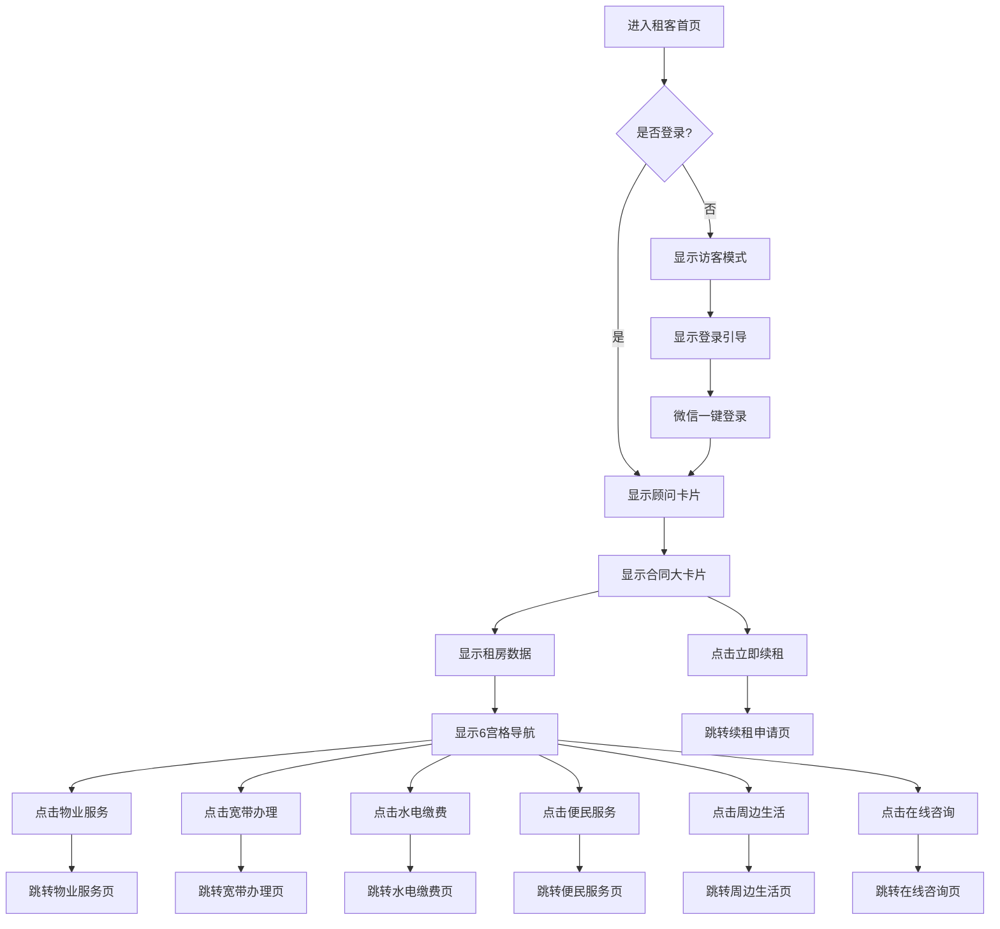

# 📜 规格说明书 (PRD)

# 现状 vs 目标对比

## 核心页面规格

| 页面 | 现状（演示版） | 目标（云开发版） | 关键变更 |
| --- | --- | --- | --- |
| **文案页 (Art)** | 本地写死数据 | 云端 articles 集合 | • 动态读取
• 权限拦截
• UGC 提报流 |
| **首页 (Index)** | Mock 龙虎榜 | 云端 users.stats 聚合 | • 真实排行
• B/C 端切换
• 入伍授权 |
| **我的页 (Profile)** | 静态展示 | 角色化仪表盘 | • 个人数据
• 角色切换
• 上帝模式入口 |
| **后台 (Admin)** | 无 | 管理驾驶舱 | • 全店日报
• 人员审核
• 数据看板 |

---

## 数据流转规格

| 场景 | 现状 | 目标 | 技术方案 |
| --- | --- | --- | --- |
| **用户身份** | 本地 roleManager | 云端 users 表 | 登录时查询 `_openid`，缓存到 `globalData.userRole` |
| **文案读取** | 写死数组 | 云端查询 | [`wx.cloud`](http://wx.cloud)`.database().collection('articles').where(\\\{...\\\}).get()` |
| **权限控制** | 前端判断 | DB Rules + 前端双重校验 | 云端规则 + RoleManager 本地拦截 |
| **提报数据** | 无 | UGC → 云函数 → DB | `submitLead` 云函数 + `msgSecCheck` 审核 |

---

## 协作宪法对照

| 条款 | 演示版违规点 | SaaS 版整改 |
| --- | --- | --- |
| **规格红线** | 前端写死数据 | 全部改为云端读取 |
| **数据法典** | 无统一 Schema | 严格遵守 users/articles/global 模型 |
| **契约优先** | 无接口定义 | 云函数必须先定义 Request/Response |

---

## 视觉规格

**已定稿标准**（不可触碰）：

- **配色**：背景 `#0a0a0a`，金色 `#d4af37`，白色 `#ffffff`
- **圆角**：卡片 `16rpx`，按钮 `8rpx`
- **间距**：通栏边距 `32rpx`，卡片间距 `24rpx`
- **字体**：标题 DIN Condensed Bold，正文 PingFang SC

**适用范围**：Art、Index 页面已对齐，Profile/Course/Admin 需跟进

---

# 模块 1：文案军火库 (Art)

**状态：** ✅ 已封档 | **对应文件：** `pages/art/`

## A. 界面与逻辑规格 (UI/Logic Specs)

| 功能单元 | 🔴 现状 / 病灶 (Current Issues) | 🟢 实战规格 (Target Specs) | 🚧 施工路径 |
| --- | --- | --- | --- |
| :--- | :--- | :--- | :--- |
| **数据源** | **写死数组**：`art.js` 里只有 3 条本地数据，上拉无反应。 | **云端活水**：连接云数据库 `articles` 集合。支持分页加载（Limit 10），下拉刷新，上拉加载更多。 | P1: 数据库通电 |
| **详情页** | **逻辑断层**：`art-detail.js` 虽接收 ID，但展示内容固定是"看房避坑"。 | **动态渲染**：根据 ID 准确查询云端单条记录。解析 `analysis` (逻辑拆解) 和 `fullContent` 字段。 | P1: 数据库通电 |
| **搜索/筛选** | **本地过滤**：只能搜到当前页面加载的那 3 条。 | **全库检索**：调用 `db.RegExp` 实现模糊查询；Tab 切换触发 `where(\\\{ category: 'xxx' \\\})`。 | P4: 生态联动 |
| **身份拦截** | **模拟弹窗**：`onCopy` 点击"去加入"后的逻辑链未闭环。 | **闭环拦截**：访客点击复制 -> 弹窗 -> 跳转 `join` -> 激活身份 -> 返回自动刷新 -> 解锁成功。 | P2: 权限守卫 |
| **UGC提报** | **孤岛页面**：`contribute` 提交没反应，或者是 console.log。 | **审核流**：提交存入 `articles` (status='pending') -> Admin 审核 -> 改为 'published' -> 列表可见。 | P5: 生产系统 |
| **收藏功能** | **一次性**：刷新页面收藏状态就丢了。 | **持久化**：建立 `favorites` 集合。加载列表时自动匹配点亮"爱心"。 | P3: 互动闭环 |

## B. 专属数据库模型 (Schema)

**集合名称：`articles`**

```json
{
  "_id": "系统生成",
  "id": Number,          // 跳转ID (前端路由用)
  "title": String,       // 标题
  "category": String,    // 枚举: ["获客", "信任", "转化", "避坑", "口播"]
  "securityLevel": String, // 枚举: ["绝密", "内部", "公开"]
  "sourceType": String,  // 枚举: ["internal", "external"] (决定金/白样式)
  "authorId": String,    // 关联 users._openid
  "stats": {             // 战绩数据
    "leads": Number,
    "views": Number,
    "likes": Number
  },
  "analysis": {          // 详情页拆解结构
    "hook": String,
    "trust": String,
    "action": String
  },
  "fullContent": String, // 完整脚本
  "status": String       // 枚举: ["published", "pending", "draft"]
}
```

## C. 专属接口契约 (Contracts)

**1. 获取文案列表 getArticleList**

- 入参: `\\\{ page: 1, pageSize: 10, category: 'all' \\\}`
- 出参: `\\\{ list: \\\[ArticleObject\\\], total: 100 \\\}`
- 逻辑: 访客只能拉取 securityLevel == '公开' 的数据。

**2. 提交文案 (UGC) submitArticle**

- 入参: `\\\{ title, content, category, leads, views \\\}`
- 出参: `\\\{ success: true, msg: '已送审' \\\}`
- 安全: 必须调用 security.msgSecCheck 校验文字是否违规。

## D. 视觉结构图 (UI Wireframe) - 分角色视图

**【视图 A：外部访客 (Visitor) - "橱窗诱惑模式"】**

```
+--------------------------------------------------+
|  [ 顶部导航 ]  获客 | 避坑 | 探盘                  |
+--------------------------------------------------+
|  [ 列表内容 ]                                      |
|  +--------------------------------------------+  |
|  | [公开] 直播间留人话术 (绿色标签)              |  |
|  | 摘要：三行文字预览...                        |  |
|  | [点击进入 -> 可阅读全文]                     |  |
|  +--------------------------------------------+  |
|  +--------------------------------------------+  |
|  | [绝密] 和平区学区房内参 (红色标签)            |  |
|  | ------------------------------------------ |  |
|  | [🔒 锁图标] 内容已模糊处理 (Gaussian Blur)    |  |
|  |      "加入星火计划，解锁完整军火库"           |  |
|  |          [ 立即加入 (绿色按钮) ]             |  |
|  +--------------------------------------------+  |
+--------------------------------------------------+
```

**【视图 B：内部全员 (Student/Anchor/Broker/Admin) - "全开模式"】**

```
+--------------------------------------------------+
|  [ 顶部导航 ]  获客 | 避坑 | 探盘 | IP人设 | 收藏 |
+--------------------------------------------------+
|  [ 列表内容 ]                                      |
|  +--------------------------------------------+  |
|  | [绝密] 和平区学区房内参 (红色标签)            |  |
|  | 摘要：核心避坑点解析...                      |  |
|  | [🔥 获客: 158]  [👁️ 浏览: 2k]               |  |
|  | [ 实心金按钮: 复制文案 ] [ 空心金: 生成海报 ] |  |
|  +--------------------------------------------+  |
|  (注：只有 Anchor/Broker/Admin 能看到底部的 "＋ 提报文案" 悬浮球) |
+--------------------------------------------------+
```

---

# 模块 2：首页门户 (Index)

**状态：** ✅ 已封档 | **对应文件：** `pages/index/`

## A. 界面与逻辑规格 (UI/Logic Specs)

| 功能单元 | 🔴 现状 / 病灶 (Current Issues) | 🟢 实战规格 (Target Specs) | 🚧 施工路径 |
| --- | --- | --- | --- |
| **身份初始化** | **盲盒状态**：依赖 app.js 默认值。无手机号授权逻辑。 | **实名入伍**：onLoad 检查 storage。若无，强制弹窗获取手机号/头像，注册到 users 库。 | P1: 入伍登记 |
| **龙虎榜** | **假名次**：榜单数据是写死的"王金牌"。 | **实时战绩**：从 users 表按 stats.totalLeads 倒序拉取 Top 3。 | P2: 龙虎榜逻辑 |
| **工具箱** | **无效按钮**：B端 8 宫格点击大多无跳转。 | **全链路**：线索管理 -> 跳 crm/client；待拍文案 -> 跳 art；邀请 -> 生成海报。 | P3: 工具箱 |
| **C端追踪** | **无痕浏览**：客户看资料没记录。 | **足迹追踪**：客户点击资料 -> 云端记一笔 -> 触发经纪人 CRM 提醒。 | P3: C端逻辑 |
| **上帝模式** | **简易触发**：点 5 次头像直接变身，不安全。 | **密室金钥**：点 5 次 -> 输密码 (123456) -> 校验通过 -> 顶部出现 [战区控制台] 按钮。 | P4: 指挥官入口 |
| **数据提报** | **弹窗假动作**：点提交只是关闭弹窗。 | **写入日报**：提交 -> 存入 reports 集合 (status='wait') -> 关联到 Admin 审核列表。 | P2: 提报流 |

## B. 专属数据库模型 (Schema)

**集合名称：`users`**

```json
{
  "_openid": "微信系统ID (主键)",
  "role": String,       // 枚举: ["visitor", "student", "anchor", "broker", "admin"]
  "name": String,       // 真实姓名
  "phone": String,      // 授权手机号 (加密)
  "store": String,      // 所属门店
  "stats": {            // 个人战绩
    "totalLeads": Number,
    "monthLeads": Number,
    "contribution": Number
  },
  "application": {      // 入伍答题档案
    "painPoint": String,
    "experience": String
  }
}
```

## C. 专属接口契约 (Contracts)

**1. 用户登录/注册 login**

- 入参: `\\\{ code: 'wx_login_code', userInfo: \\\{...\\\} \\\}`
- 出参: `\\\{ token: 'xxx', role: 'student', userProfile: \\\{...\\\} \\\}`
- 逻辑: 如果库里没这个人，自动创建并设为 visitor；如果有，返回最新 role。

**2. 获取龙虎榜 getLeaderboard**

- 入参: `\\\{ type: 'month' \\\| 'total' \\\}`
- 出参: `\\\{ top3: \\\[UserObject\\\], me: \\\{ rank: 12, ... \\\} \\\}`
- 逻辑: 必须按 stats.totalLeads 降序排列，取前 3 名。

## D. 视觉结构图 (UI Wireframe) - 分角色视图

**【视图 A：外部访客 (Visitor/Customer) - "C端单页诱饵"】**

```
+--------------------------------------------------+
|  [ 顾问名片卡 ] 王金牌 (置业顾问)  [📞] [💬]      |
+--------------------------------------------------+
|  [ 12宫格核心资料包 (点击强制弹手机号授权) ]         |
|  +-------+ +-------+ +-------+                   |
|  |🗺️地图 | |📉降价 | |🏫学区 | ...               |
|  +-------+ +-------+ +-------+                   |
+--------------------------------------------------+
|  [ 底部 Slogan ] 🔒 安全隐私由星火计划保障          |
|  (无底部导航栏 TabBar，强制停留)                   |
+--------------------------------------------------+
```

**【视图 B1：星火学员 (Student) - "B端学习版"】**

```
+--------------------------------------------------+
|  [ 仪表盘 ]  学习时长: 12h | 收藏: 5篇             |
+--------------------------------------------------+
|  [ 跑马灯 ] 📢 恭喜王主播成交一套...                |
+--------------------------------------------------+
|  [ 8宫格作业区 (仅显示学习类) ]                     |
|  +-------+ +-------+ +-------+ +-------+         |
|  |🎥课程 | |📚文案 | |⭐收藏 | |📅日程 |         |
|  +-------+ +-------+ +-------+ +-------+         |
|  (❌ 严禁出现 "提报"、"线索" 入口)                  |
+--------------------------------------------------+
|  [ 龙虎榜预览 ] (可看，激励用)                      |
+--------------------------------------------------+
```

**【视图 B2：正规军 (Anchor/Broker) - "B端战斗版"】**

```
+--------------------------------------------------+
|  [ 仪表盘 ]  本月获客: 158 | 本月带看: 12          |
+--------------------------------------------------+
|  [ 8宫格作业区 (全功能) ]                          |
|  +-------+ +-------+ +-------+ +-------+         |
|  |📝提报 | |🕸️线索 | |🎥课程 | |🎛️更多 |         |
|  +-------+ +-------+ +-------+ +-------+         |
|  (注："提报"按钮为绿色高亮，极度显眼)               |
+--------------------------------------------------+
|  [ 龙虎榜预览 ] (点击头像跳转榜单详情)               |
+--------------------------------------------------+
```

---

# 模块 3：我的指挥所 (Profile)

**版本号：** V3.0 (最终合并版)  

**状态：** ✅ 封档 | **对应文件：** `pages/profile/`

## A. 深度诊断与施工规格 (Specs)

*(已融合总指挥的原话需求与技术实现标准)*

| 功能单元 | 🔴 现状 / 病灶 (您的痛点原话) | 🟢 实战规格 (Target Specs) | 🚧 施工路径 |
| --- | --- | --- | --- |
| **访客拦截** | **诱饵失效**：访客现在点了进度、勋章只是弹个文字提示，没引导加入。 | **强力引流**：访客能看到仪表盘和前3名，但点击任何功能（除头像外），直接跳转 pages/join/join（入伍问卷页）。 | P2: 身份打通 |
| **学员权限** | **角色越位**：学员页面里竟然有"去贡献"按钮？学员只能学习，不能提报！ | **严格禁产**：学员版仪表盘只显"学习进度"和"收藏"。绝对隐藏"去贡献"按钮。 | P5: 生产系统 |
| **主播/经纪** | **战意不足**：不进榜单就看不到自己排第几。要有"去贡献"入口。 | **竞争看板**：仪表盘显示"全量排名: 第X名"和"贡献篇数"。右侧放置显眼的红色 [去贡献] 按钮。 | P3: 核心页实装 |
| **管理员** | **数据瞎编**：看不到全店的情况。 | **上帝视角**：仪表盘显示"全店今日概况"（今日总线索、待审提报数）。 | P3: 核心页实装 |
| **上帝模式** | **极度不安全**：点头像5次直接进，随便谁都能乱改数据。 | **密码防线**：连点5次 -> 弹出密码框 -> 输入正确密码(123456)且身份为Admin -> 才显示控制台入口。 | P4: 权限守卫 |
| **UI细节** | **质感不够**：头像那个金圈没铺满，感觉不像正规军。 | **视觉修正**：头像边框改为 6rpx 满铺流光金渐变，加外发光 box-shadow。 | P3: UI精修 |

## B. 专属数据库模型 (Schema)

*(请追加到 users 表定义下方)*

**集合名称：`users` (Profile 业务字段)**

```json
{
  "role": "visitor | student | anchor | broker | admin",
  "stats": {
    "totalLeads": Number,           // 累计获客 (主播/经纪人排名依据)
    "monthRank": Number,            // 系统每日计算存入的排名
    "articleContributions": Number, // 文案贡献数 (仅主播/经纪人可见)
    "studyProgress": Number         // 学习进度 0-100 (仅学员可见)
  },
  "isNewbie": Boolean,              // 是否属于新秀 (注册<30天，优先显新秀榜)
  "medals": [ "medal_id_01", "medal_id_02" ] // 已解锁勋章列表
}
```

## C. 专属接口契约 (Contracts)

*(Cursor 编写代码时的死规定)*

**1. 获取个人中心数据 getProfileData**

- 入参: `\\\{\\\}` (自动取 OpenID)
- 出参: `\\\{ role, dashboard: \\\[\\\], rankInfo: \\\{\\\}, medals: \\\[\\\] \\\}`
- 逻辑:
    - Visitor: 返回空数据，前端点击触发 MapsTo(join)。
    - Student: dashboard 返回 `\\\[\\\{label:'学习进度', val:'45%'\\\}\\\]`。
    - Anchor: dashboard 返回 `\[\{label:'全量排名', val:'15'\}, \{label:'贡献', val:'12'\}\]`。

## D. 视觉结构图 (UI Wireframe) - 分角色视图

**【视图 A：外部访客 (Visitor) - "全拦截模式"】**

```
+--------------------------------------------------+
|  [ 头像 ] 游客 (未认证)                           |
+--------------------------------------------------+
|  [ 仪表盘 (虚化/灰色) ]                           |
|  学习进度 0%  |  解锁勋章 0                       |
+--------------------------------------------------+
|  [ 勋章墙 (灰色) ] (点击 -> 跳加入页)              |
+--------------------------------------------------+
|  [ 底部榜单 (仅前3) ] (点击 -> 跳加入页)           |
|  🔒 加入星火计划，查看完整榜单                     |
+--------------------------------------------------+
```

**【视图 B：星火学员 (Student) - "纯学习模式"】**

```
+--------------------------------------------------+
|  [ 头像(金边) ] 学员 (Student)                    |
+--------------------------------------------------+
|  [ 仪表盘 ]                                      |
|  学习进度 45%  |  收藏文案 12  |  学习时长 20h     |
+--------------------------------------------------+
|  [ 勋章墙 ] (点击弹窗显示解锁条件)                  |
+--------------------------------------------------+
|  [ 最近学习 ] (显示课程进度，点继续播放)             |
+--------------------------------------------------+
|  (❌ 严禁出现 "去贡献" 按钮)                       |
+--------------------------------------------------+
```

**【视图 C：正规军 (Anchor/Broker) - "竞争模式"】**

```
+--------------------------------------------------+
|  [ 头像(金边) ] 主播 (Anchor)                     |
+--------------------------------------------------+
|  [ 仪表盘 ]                                      |
|  全区排名 15   |  文案贡献 8   |  累计获客 158     |
|              [ 🔴 去贡献 (红色按钮) ]             |
+--------------------------------------------------+
|  [ 新秀榜预览 ] (若入职<30天，优先显示此栏)         |
+--------------------------------------------------+
|  [ 勋章墙 ] (获客达人/带看之王/卷王)                |
+--------------------------------------------------+
|  [ 底部榜单 ] (全量展示，高亮自己)                  |
+--------------------------------------------------+
```

**【视图 D：管理员 (Admin) - "上帝监控模式"】**

```
+--------------------------------------------------+
|  [ 头像 ] 指挥官 (Admin)  (已输密码解锁)           |
+--------------------------------------------------+
|  [ 全店日报仪表盘 ]                                |
|  今日总线索: 158  |  今日总带看: 45                |
+--------------------------------------------------+
|  [ 待办红点区 ]                                   |
|  待入伍审批: 3人  |  待审核文案: 5篇               |
+--------------------------------------------------+
|  [ 底部管理入口 ]                                 |
|  [人员管理]  [内容审核]  [系统设置]  [退出模式]     |
+--------------------------------------------------+
```

---

# 模块 4：战区指挥部 (Admin)

**版本号：** V3.0 (全功能旗舰版)  

**状态：** ✅ 封档 | **对应文件：** `pages/admin/`

## A. 深度诊断与施工规格 (Specs)

*(融合指挥官原话痛点与行业高阶需求)*

| 功能单元 | 🔴 现状 / 病灶 (Current Issues) | 🟢 实战规格 (Target Specs) | 🚧 施工路径 |
| --- | --- | --- | --- |
| **上帝模式** | **人格分裂**：现在点5次只弹窗，不改变页面。我要的是密码通过后，我的页直接变身"指挥官大屏"。 | **全局变身**：输对密码(123456) -> 存 isAdmin=true -> 我的页重绘：头部变"全店日报"，底部显所有管理入口。 | P4: 权限守卫 |
| **全店日报** | **数据瞎编**：没有全店统计。今日访问人数不重要，换核心业务数据。 | **核心战报**：
1. 今日总获客 (主播提报累加)。
2. 今日总带看 (经纪提报累加)。
3. 待办红点 (待审人+待审文)。 | P4: 数据聚合 |
| **门店管理** | **(新增) 散兵游勇**：没有组织架构，人都在一个大池子里，没法按"店"考核。 | **组织架构树**：管理员可创建/编辑"门店" (如: 河西一店)。人员审核时，必选归属门店标签。 | P5: 高阶SaaS |
| **上帝之手** | **(新增) 资源浪费**：大客户在公海里没人管，或者流转给不合适的人。 | **强制指派**：管理员在公海池选中线索 -> 点击 [指派] -> 强插给指定销冠 (无视自动流转规则)。 | P5: 高阶SaaS |
| **系统开关** | **(新增) 运维累死**：太忙没空一个个审，或者遇到严打需要全员禁言。 | **全局配置**：新增 [系统设置] 模块。
- 免审模式：开关打开，老员工提报/发文直通。
- 全员禁言：开关打开，禁止UGC提交。 | P5: 高阶SaaS |
| **渠道追踪** | **(新增) 来源不明**：不知道学员是谁拉来的，或者是扫哪个海报来的。 | **招募令**：管理员生成 [渠道邀请码]。学员入伍填表时必填/选填，用于后期算人头功劳。 | P5: 高阶SaaS |
| **UI 细节** | **图标儿戏**：首页图标不够正规军。底部空了一块。 | **视觉填补**：图标全换 DIN风格金色线条。底部增加 Slogan："赋能一个人，激活一家店..."。 | P3: UI精修 |

## B. 专属数据库模型 (Schema)

*(请追加到 Notion 的 数据库模型 页面)*

**1. 门店集合 `stores` (新增)**

```json
{
  "_id": "store_001",
  "name": "河西大悦城店",
  "managerId": "user_openid_xxx", // 店长
  "memberCount": Number,
  "createTime": Timestamp
}
```

**2. 系统配置表 `system_config` (新增，单例)**

```json
{
  "_id": "global_config",
  "auditFreeMode": Boolean, // 是否免审
  "maintenanceMode": Boolean, // 是否维护中
  "announcements": [ ... ] // 滚动播报列表
}
```

**3. 用户表 `users` (字段追加)**

```json
{
  "storeId": "store_001", // 归属门店ID
  "inviterId": "user_openid_yyy" // 邀请人ID (渠道来源)
}
```

## C. 专属接口契约 (Contracts)

**1. 获取指挥部大盘数据 `getAdminDashboard`**

- 入参: `\{\}`
- 出参:

```json
{
  "stats": { "leads": 158, "showings": 45 },
  "pending": { "audit": 3, "articles": 5 },
  "systemStatus": { "auditFree": false }
}
```

**2. 强制指派线索 `manualAssignClue`**

- 入参: `\{ clueId: "xxx", toUserId: "yyy", reason: "Boss指派" \}`
- 逻辑:
    - 强制修改 clients 表的 owner_id 为目标人。
    - 状态改为 assigned。
    - 重置 deadline_time (给新主人重新倒计时)。
    - 写入操作日志 logs。

## D. 视觉结构图 (UI Wireframe)

```
+--------------------------------------------------+
|  [状态栏] 12:00 PM                        🔋 100% |
+--------------------------------------------------+
|  [标题栏] 战区指挥部 (Admin Dashboard)             |
+--------------------------------------------------+
|                                                  |
|  [ 核心战绩卡片 (黑金渐变背景 + 动态流光) ]         |
|  +--------------------------------------------+  |
|  |  今日总获客     今日总带看     全店总人数    |  |
|  |  [158] ↗       [45] -        [45]        |  |
|  +--------------------------------------------+  |
|  [ 🔴 待办军务: 3 人申请入伍 | 5 篇文案待审 ]      |
|                                                  |
|  [ 指挥作业区 (Grid Layout - 金色线条图标) ]       |
|  +--------------+  +--------------+  +---------+ |
|  | 👥 人员审批   |  | 📝 内容审核   |  | 📢 播报 | |
|  +--------------+  +--------------+  +---------+ |
|  +--------------+  +--------------+  +---------+ |
|  | ⚔️ 门店管理   |  | 🖐️ 线索指派   |  | 🎛️ 设置 | |
|  +--------------+  +--------------+  +---------+ |
|                                                  |
|  [ 动态战报流 (List View - 磨砂玻璃底) ]           |
|  标题：今日全店实时动态                            |
|  ----------------------------------------------  |
|  • [入伍] 王小二 (河西店) 申请加入       10:00  |
|  • [提报] 李销冠 获客+1 (免审通过)       10:05  |
|  • [警告] 张三 连续 3 天未登录           11:00  |
|  ----------------------------------------------  |
|                                                  |
+--------------------------------------------------+
```

---

**🛡️ 参谋长确认：**

总指挥，这份 V3.0 规格书已经把 "SaaS 1.0 的基础" 和 "SaaS 2.0 的野心" 完美结合了。

- 对于 1.0：我们先把"人员审批"、"全店日报"做出来，能跑通。
- 对于未来：数据库里留好了 storeId 和 inviterId，以后想开分店、算渠道佣金，随时能开。

---

# 模块 5：实战商学院 (Course)

**版本号：** V2.1 (已实现版)

**状态：** ✅ 已完成 | **对应文件：** `pages/course/`, `pages/course-detail/`, `pages/admin/course-manage/`

## A. 实际实现状态

**实现时间**：2026-01-30

**实现内容**：
- 课程管理页面（course-manage）- 课程列表、新增、编辑功能
- init_courses云函数 - 初始化24门课程数据
- 课程封面图片上传 - 支持上传图片到云存储
- 课程信息编辑 - 标题、分类、作者、时长、链接、简介、标签
- 课程管理页面UI优化 - 添加悬浮球按钮、优化标题样式
- get_courses和get_course_detail云函数 - 课程数据从数据库读取
- 课程页面显示网络图片 - 修复URL格式问题

## B. 深度诊断与施工规格 (Specs)

| 功能单元 | 🔴 现状 / 病灾 (您的痛点原话) | 🟢 实战规格 (Target Specs) | 🚧 施工路径 |
| --- | --- | --- | --- |
| **内容定位** | **方向错误**：之前的课太老土，教销售转化。我们要搞新媒体、搞流量！ | **新媒体特训**：内容全换！
1. 资质认证 (怎么开通直播)。
2. 剪映实操 (手把手教剪辑)。
3. AI 赋能 (用 AI 写脚本)。 | P1: 数据库初始化 |
| **学用分离** | **只看不练**：看完视频没东西落地。 | **关联军火库**：详情页底部必须挂载 [本课实战作业]。
例如：AI 写脚本课 -> 下方直接挂"AI 提示词模板"，点击跳文案库复制。 | P4: 生态联动 |
| **视频成本** | **太贵且没必要**：直接传云存储太烧钱。 | **外链为王**：Admin 后台支持填入 公众号文章链接 或 视频号链接。点击直接跳转，流量导回私域。 | P3: 核心页实装 |
| **访客体验** | **门槛太高**：访客进来啥也看不见，不想留电话。 | **试看诱饵**：访客可进入详情页，只能看简介和目录。点击播放或查看作业时 -> 弹窗："加入星火计划，解锁全套剪映教程"。 | P2: 权限守卫 |
| **考核机制** | **混子天堂**：拉进度条就算学完了？ | **时长锁**：监听播放时长。SaaS 1.0 必须播放完 80% 才能点亮"已学完"状态。 | P5: 激励闭环 |

## B. 专属数据库模型 (Schema)

*(请追加到 Notion 数据库页面)*

**集合名称：`courses`**

```json
{
  "_id": "course_001",
  "title": "保姆级教程：房产号如何通过直播资质认证？",
  "coverUrl": "cloud://.../cover_auth.jpg",
  "category": "setup", // 枚举: setup(起号认证), editing(剪映实操), ai(AI赋能), live(直播实战)
  "mediaType": "link", // 统一用外链
  "mediaUrl": "
```

## C. 专属接口契约 (Contracts)

**1. 获取课程列表 `getCourseList`**

- 入参: `\{ category: 'ai' \}`
- 出参: `\[ \{id, title, cover, categoryName: 'AI赋能', isLearned: false\} \]`

**2. 获取课程详情 `getCourseDetail`**

- 入参: `\{ courseId: "xxx" \}`
- 出参: `\{ courseInfo: \{...\}, relatedArticle: \{...\}, permission: boolean \}`
- 逻辑:
    - Visitor: permission = false。前端展示标题简介，点击播放/作业触发 MapsTo(join)。
    - Student/Staff: permission = true。返回完整 mediaUrl。

## D. 视觉结构图 (UI Wireframe)

```
+--------------------------------------------------+
|  [ 视频封面/播放区 (16:9) ]                        |
|  [ ▶️ 跳转视频号/公众号学习 ]                       |
|  (访客点击 -> 拦截弹窗 -> 跳加入页)                 |
+--------------------------------------------------+
|  [ 标题栏 ]                                        |
|  【AI】1分钟写出10条探盘脚本 (附提示词)             |
|  🔥 3056 人已学   🕒 8 分钟                        |
+--------------------------------------------------+
|  [ 课程 Tabs ]                                     |
|  [ 简介 ]    [ 目录 ]    [ 讨论 ]                  |
|  ----------------------------------------------  |
|  本课程教你使用 DeepSeek 快速生成口播文案...        |
|  ----------------------------------------------  |
|                                                  |
|  [ 关联实战作业 (强关联) ]                         |
|  +--------------------------------------------+  |
|  | 📝 本课配套工具                              |  |
|  | 标题：DeepSeek 房产探盘专用 Prompt 指令        |  |
|  | [ 去复制 > ] (点击跳转文案详情页)              |  |
|  +--------------------------------------------+  |
|                                                  |
|  [ 底部操作栏 ]                                    |
|  [ ⭐ 收藏 ]   [ 🔗 分享 ]   [ ✅ 标为已学 ]      |
+--------------------------------------------------+
```

---

**🛡️ 参谋长确认：**

总指挥，5 大战区（Art, Index, Profile, Admin, Course）图纸已全部封顶！

- Course 页现在的状态：
    - 内容：全是干货（剪映、AI、资质认证）。
    - 逻辑：外链播放（省钱）、关联作业（落地）、访客拦截（留资）。

---

# 模块 6：C端核心诱饵库 (Tools)

**版本号：** V1.0 (9宫格实战版)  

**状态：** ✅ 封档 | **对应文件：** `pages/tools/*` 及 `pages/index`

## A. 深度诊断与施工规格 (Specs)

| 宫格名称 | 🟢 实战规格 (Target Specs) | 🔧 技术实现方案 | 🚧 施工路径 |
| --- | --- | --- | --- |
| **1. 房贷计算器** | [工具] 支持商贷/公积金/组合贷。输入总价、利率、年限，实时出月供明细。 | 纯前端 JS 计算 (参考微甄房 UI)。不连库。 | P3: 二级页实装 |
| **2. 税费计算器** | [工具] 输入：面积、总价、首套/二套、满二/满五。输出：契税、个税、增值税。 | 纯前端 JS 计算。不连库。 | P3: 二级页实装 |
| **3. 购房避坑指南** | [内容] 文章列表。 | 复用 pages/art/list，参数 category=avoid。 | P1: 数据库通电 |
| **4. 学区地图** | [诱饵] 点击进入详情页，展示模糊地图。底部按钮：[ 授权手机号，获取高清原图 ]。 | 新建 pages/tools/map-bait。 | P2: 权限守卫 |
| **5. 楼盘降价优惠** | [情报] 文章列表 (每周更新)。 | 复用 pages/art/list，参数 category=discount。 | P1: 数据库通电 |
| **6. 不利因素公示** | [情报] 文章列表 (按楼盘搜)。 | 复用 pages/art/list，参数 category=bad_news。 | P1: 数据库通电 |
| **7. 快速卖房技巧** | [干货] 单篇核心文章。 | 跳转 pages/art/detail?id=sell_skill。 | P1: 数据库通电 |
| **8. 政策一览** | [聚合] 顶部 Tab 切换：学区/贷款/税费/落户/限购。下方显示对应文章。 | 复用 pages/art/list，支持顶部 Tab 筛选。 | P1: 数据库通电 |
| **9. 一键咨询** | [连接] 底部弹窗 (ActionSheet)：[ 📞 拨打电话 ] / [ 💬 复制微信号 ]。 | 调用 wx.makePhoneCall。 | P3: 二级页实装 |

## B. 专属数据库模型 (Schema)

**（复用 articles 表，仅需规范 category 字段的枚举值）**

**集合名称：**`articles` **(字段补充)**

```json
{
  "category": "avoid (避坑) | discount (降价) | bad_news (不利) | policy_school (学区政策) | policy_loan (贷款政策) | policy_tax (税费政策) | policy_settle (落户政策) | policy_limit (限购政策) | sell_skill (卖房技巧)",
  "title": "2026天津和平区最新学区划片原图.jpg",
  "baitType": "image | pdf | text",  // 诱饵类型
  "content": "cloud://.../map_blur.jpg",  // 模糊图
  "originalContent": "cloud://.../map_hd.jpg"  // 高清图(授权后发)
}
```

## C. 接口契约 (Contracts)

**1. 获取计算器结果 (纯前端)**

- **逻辑**: 无需云函数，直接在 calculator.js 里写死公式（参照天津最新利率）。

**2. 获取诱饵内容 getBaitContent**

- **入参**: `{ articleId: "xxx" }`
- **出参**: `{ isAuthorized: false, blurImg: "..." }`
- **逻辑**:
    - 若用户未授权手机号，返回模糊图。
    - 若已授权，返回 originalContent 高清图链接。

## D. 视觉结构图 (UI Wireframe)

### 【页面：房贷/税费计算器 (Tool Page)】

```
+--------------------------------------------------+
|  [ 标题栏 ]  房贷计算器                 [ 重置 ]  |
+--------------------------------------------------+
|  [ 贷款类型 ] (●)商业  ( )公积金  ( )组合        |
|  ----------------------------------------------  |
|  [ 房屋总价 ]        [ 200 ] 万                  |
|  [ 首付比例 ]        [ 30% ] >                   |
|  [ 贷款年限 ]        [ 30年 ] >                  |
|  [ 贷款利率 ]        [ 3.45% (LPR-40) ] >        |
|  ----------------------------------------------  |
|  [ 开始计算 (金底黑字按钮) ]                       |
+--------------------------------------------------+
|  [ 计算结果卡片 (黑金渐变) ]                       |
|  每月还款:  8,900 元                             |
|  利息总额:  120 万                               |
|  (含税费结果：契税 2万 | 个税 0 | 增值税 0)        |
+--------------------------------------------------+
```

### 【页面：学区地图/诱饵页 (Bait Page)】

```
+--------------------------------------------------+
|  [ 图片预览区 (全屏) ]                             |
|                                                  |
|       ( 一张磨砂模糊的地图图片 )                   |
|           🔒 绝密资料                            |
|                                                  |
+--------------------------------------------------+
|  [ 底部悬浮栏 (白底/黑底) ]                        |
|  文案：为了防止同行抄袭，查看高清原图需验证身份        |
|  [ 🟢 微信一键授权查看 (绿色按钮) ]                 |
+--------------------------------------------------+
```

---

**🛡️ 参谋长确认：**

总指挥，6 大模块（Art, Index, Profile, Admin, Course, Tools） 的图纸全部绘制完毕！

我们已经把一个庞大的系统，拆解成了 6 份可执行、可验收、低成本 的施工文档。

**🛡️ 参谋长确认：**

总指挥，6 大模块（Art, Index, Profile, Admin, Course, Tools） 的图纸全部绘制完毕！

我们已经把一个庞大的系统，拆解成了 6 份可执行、可验收、低成本 的施工文档。

---

# 模块 7：入伍申请页 (Join)

**版本号：** V2.0 (终极定稿)  

**状态：** ✅ 已锁定待施工 | **对应文件：** `pages/join/`

**解决痛点：** 拦截访客流量，清洗出精准的 B 端兵源。

## A. 病灶与规格 (Specs)

| 功能单元 | 🔴 现状 / 病灶 (Current Issues) | 🟢 实战规格 (Target Specs) | 🚧 施工路径 |
| --- | --- | --- | --- |
| **身份激活** | **直接通过**：点击"加入"按钮直接改为 student，无审核流程。 | **提交申请流**：填表 → 提交 → 云函数查重 → 存入 applications (status='pending') → 等待 Admin 审核。 | P3: 核心页实装 |
| **手机号** | **无采集**：没有手机号授权逻辑。 | **微信授权**：必须使用微信 `open-type="getPhoneNumber"` 组件，拒绝手填假号。获取 cloudID 传给云函数解密。 | P3: 核心页实装 |
| **身份细分** | **一刀切**：所有人都变 student。 | **三级段位**：
• 经纪人 (有拍摄经验)
• 经纪人 (无拍摄经验)
• 店东/商圈经理
后台 CRM 根据不同段位给不同赋能策略。 | P3: 核心页实装 |
| **痛点调研** | **无**：没有需求调研。 | **四选多**：
• 缺客流
• 没素材
• 不会播
• 难成交
用于后续精准推送课程/文案。 | P3: 核心页实装 |
| **查重机制** | **无**：可以重复提交。 | **云函数查重**：根据 `_openid` 查询 applications 表，若已存在则返回 code=-1，提示"已提交，等待审核"。 | P3: 核心页实装 |
| **视觉风格** | **橙绿配色**：与黑金主题不一致。 | **黑金严肃**：背景 #0a0a0a，金色 #d4af37，磨砂卡片，流光按钮。 | P3: UI 精修 |

### 核心逻辑

- **唯一入口**：这是系统内所有"访客拦截"动作后的终点站。
- **身份清洗**：必须精准区分"小白"和"老兵"，因为后台 CRM 给他们的赋能策略不同。
- **强制授权**：必须使用微信手机号授权（拒绝手填假号）。

### 业务流程

1. `onLoad` → 检查身份 → 若已是会员 → 跳转首页 (防重复)。
2. 填写表单 → 提交 → 查重 (Cloud Function) → 入库 `applications`。
3. 成功 → 提示"审核中" → 延迟跳转首页。

---

## B. 专属数据库模型 (Schema)

**集合名称：** `applications`

```json
{
  "_id": "uuid",
  "_openid": "user_openid",
  "name": "张三",
  "phone": "13800138000",
  "identity": "agent_with_exp",
  "painPoints": ["traffic", "content"],
  "status": "pending",
  "createTime": "serverDate",
  "reviewedAt": "timestamp (可选)",
  "reviewedBy": "string (_openid, 可选)",
  "rejectReason": "string (可选)"
}
```

### 身份枚举 (Identity Enum) - 严格执行

- **agent_with_exp**: 经纪人 (有拍摄经验)
- **agent_no_exp**: 经纪人 (无拍摄经验)
- **store_owner**: 店东/商圈经理

### 痛点枚举 (Pain Points Enum)

- **traffic**: 缺客流
- **content**: 没素材
- **skill**: 不会播
- **convert**: 难成交

### 状态枚举 (Status Enum)

- **pending**: 待审核
- **approved**: 已通过
- **rejected**: 已拒绝

---

## C. 专属接口契约 (Contracts)

**云函数名称：** `submit_application`

> **安全原则**：建议走云函数（而非直接前端操作 DB），防止恶意提交。
> 

### Request (入参)

```json
{
  "name": "String (真实姓名)",
  "cloudID": "String (微信手机号加密数据)",
  "identity": "String (枚举值)",
  "painPoints": "Array<String> (痛点枚举数组)"
}
```

### Response (出参)

```json
{
  "code": 0,
  "message": "String",
  "data": {
    "applicationId": "String (_openid)"
  }
}
```

### Error Codes

- **0**: 成功
- **-1**: 已存在（重复申请）
- **500**: 服务器错误
- **1001**: 参数错误（name 为空/identity 非法/painPoints 为空）
- **1002**: 手机号解密失败

### 云函数核心逻辑

```jsx
// 1. 解密手机号
const result = await cloud.openapi.phonenumber.getPhoneNumber({
  cloudID: cloudID
});
const phone = result.phoneNumber;

// 2. 查重
const { data: existing } = await db.collection('applications')
  .where({ _openid: openid })
  .get();

if (existing.length > 0) {
  return { code: -1, message: '您已提交过申请，请等待审核' };
}

// 3. 参数验证
if (!name || !identity || !painPoints || painPoints.length === 0) {
  return { code: 1001, message: '参数错误' };
}

// 4. 入库
await db.collection('applications').add({
  data: {
    _openid: openid,
    name: name,
    phone: phone,
    identity: identity,
    painPoints: painPoints,
    status: 'pending',
    createTime: db.serverDate()
  }
});

return { code: 0, message: '申请已提交', data: { applicationId: openid } };
```

---

## D. 视觉结构图 (Wireframe)

**风格：** 黑金 (Black & Gold) | 磨砂质感 | 严肃

```
+--------------------------------------------------+
|  [ 海报区 ]                                      |
|  图片：星火燎原视觉图 (16:9)                      |
|  主标：赋能一个人，激活一家店                      |
|  副标：天津战区 · 2026 实战计划                   |
+--------------------------------------------------+
|                                                  |
|  [ 核心表单 - 磨砂黑卡片 ]                        |
|                                                  |
|  1. 姓名: [ 输入框: 请输入真实姓名 ]               |
|                                                  |
|  2. 电话: [ 🟢 微信一键授权手机号 ] (核心组件)     |
|     (open-type="getPhoneNumber")                |
|                                                  |
|  3. 当前段位 (必选):                              |
|     (○) 经纪人 (有拍摄经验)                       |
|     (○) 经纪人 (无拍摄经验)                       |
|     (○) 店东/商圈经理                            |
|                                                  |
|  4. 核心痛点 (多选):                              |
|     [缺客流] [没素材] [不会播] [难成交]           |
|     (选中样式：金底黑字)                          |
|                                                  |
+--------------------------------------------------+
|                                                  |
|  [ 底部栏 ]                                      |
|  [ ⚡️ 立即申请入伍 (流光金按钮) ]                  |
|  (点击触发 submit 逻辑)                           |
|                                                  |
|  [ 提示文字 (灰色小字) ]                          |
|  "如果是链家内部主播，加入后请去'我的'页面        |
|   进行员工认证"                                   |
+--------------------------------------------------+
```

---

## E. 前端实现要点

### WXML 核心组件

```xml
<!-- 微信手机号授权按钮 -->
<button 
  open-type="getPhoneNumber" 
  bindgetphonenumber="onGetPhoneNumber"
  class="phone-auth-btn">
  🟢 微信一键授权手机号
</button>

<!-- 身份单选 -->
<radio-group bindchange="onIdentityChange">
  <label>
    <radio value="agent_with_exp"/>
    经纪人 (有拍摄经验)
  </label>
  <label>
    <radio value="agent_no_exp"/>
    经纪人 (无拍摄经验)
  </label>
  <label>
    <radio value="store_owner"/>
    店东/商圈经理
  </label>
</radio-group>

<!-- 痛点多选 -->
<checkbox-group bindchange="onPainPointsChange">
  <label><checkbox value="traffic"/>缺客流</label>
  <label><checkbox value="content"/>没素材</label>
  <label><checkbox value="skill"/>不会播</label>
  <label><checkbox value="convert"/>难成交</label>
</checkbox-group>
```

### JS 核心逻辑

```jsx
Page({
  data: {
    name: '',
    phoneCloudID: '',
    identity: '',
    painPoints: []
  },

  onLoad() {
    // 检查是否已是会员
    const role = wx.getStorageSync('userRole');
    if (role && role !== 'visitor') {
      wx.showToast({ title: '您已是会员', icon: 'none' });
      setTimeout(() => {
        wx.reLaunch({ url: '/pages/index/index' });
      }, 1500);
    }
  },

  onGetPhoneNumber(e) {
    if (e.detail.cloudID) {
      this.setData({ phoneCloudID: e.detail.cloudID });
      wx.showToast({ title: '授权成功', icon: 'success' });
    } else {
      wx.showToast({ title: '授权失败，请重试', icon: 'none' });
    }
  },

  onIdentityChange(e) {
    this.setData({ identity: e.detail.value });
  },

  onPainPointsChange(e) {
    this.setData({ painPoints: e.detail.value });
  },

  submitApplication() {
    // 表单验证
    if (!this.data.name) {
      wx.showToast({ title: '请输入姓名', icon: 'none' });
      return;
    }
    if (!this.data.phoneCloudID) {
      wx.showToast({ title: '请授权手机号', icon: 'none' });
      return;
    }
    if (!this.data.identity) {
      wx.showToast({ title: '请选择身份', icon: 'none' });
      return;
    }
    if (this.data.painPoints.length === 0) {
      wx.showToast({ title: '请至少选择一个痛点', icon: 'none' });
      return;
    }

    wx.showLoading({ title: '提交中...' });

    // 调用云函数
    wx.cloud.callFunction({
      name: 'submit_application',
      data: {
        name: this.data.name,
        cloudID: this.data.phoneCloudID,
        identity: this.data.identity,
        painPoints: this.data.painPoints
      },
      success: res => {
        wx.hideLoading();
        if (res.result.code === 0) {
          wx.showToast({ 
            title: '申请已提交，等待审核', 
            icon: 'success',
            duration: 2000
          });
          setTimeout(() => {
            wx.reLaunch({ url: '/pages/index/index' });
          }, 2000);
        } else if (res.result.code === -1) {
          wx.showModal({
            title: '重复申请',
            content: '您已提交过申请，请等待审核结果',
            showCancel: false
          });
        } else {
          wx.showToast({ 
            title: res.result.message || '提交失败，请重试', 
            icon: 'none' 
          });
        }
      },
      fail: err => {
        wx.hideLoading();
        wx.showToast({ title: '网络错误', icon: 'none' });
        console.error('云函数调用失败', err);
      }
    });
  }
});
```

---

## F. 与现有系统的差异对比

| 功能点 | 当前版本 (演示版) | V2.0 新规格 (SaaS版) | 变更类型 |
| --- | --- | --- | --- |
| **身份激活** | 直接改为 student | 提交申请 → 待审核 | 🔴 核心变更 |
| **手机号** | 无 | 微信授权必填 | 🔴 核心变更 |
| **身份选择** | 无 | 三选一（有经验/无经验/店东） | 🟢 新增 |
| **痛点调研** | 无 | 四选多 | 🟢 新增 |
| **查重机制** | 无 | 云函数查重 | 🟢 新增 |
| **视觉风格** | 橙绿配色 | 黑金配色 | 🟡 优化 |
| **跳转逻辑** | 直接激活 → 首页 | 提交 → 审核中提示 → 首页 | 🔴 核心变更 |

---

## G. 施工检查清单

### 数据库准备

- [ ]  创建 `applications` 集合
- [ ]  配置集合索引（`_openid` 唯一索引）
- [ ]  配置数据库权限规则（仅自己可读写自己的申请）

### 云函数开发

- [ ]  创建 `submit_application` 云函数
- [ ]  实现查重逻辑
- [ ]  实现手机号解密（`cloud.openapi.phonenumber.getPhoneNumber`）
- [ ]  实现数据验证（name/identity/painPoints）
- [ ]  错误处理与日志记录

### 前端开发

- [ ]  页面布局（黑金风格，磨砂卡片）
- [ ]  表单组件（姓名输入/授权按钮/单选/多选）
- [ ]  表单验证逻辑（前端二次校验）
- [ ]  云函数调用
- [ ]  成功/失败提示（Toast + Modal）
- [ ]  跳转逻辑（防重复进入 + 延迟跳转）

### 测试验证

- [ ]  正常提交流程（填表 → 提交 → 成功提示 → 跳转）
- [ ]  重复提交拦截（同一 openid 只能提交一次）
- [ ]  表单验证覆盖（空姓名/未授权/未选身份/未选痛点）
- [ ]  授权失败处理（用户拒绝授权）
- [ ]  网络异常处理（云函数超时/失败）
- [ ]  已是会员防重复（onLoad 检查并跳转）

---

## H. 后续对接

### Admin 后台审核

- 管理员在 `pages/admin` 查看 `applications` 待审核列表。
- 点击"通过" →
    - 修改 `applications` 表：`status: 'approved'`, `reviewedAt: now`, `reviewedBy: admin_openid`
    - 创建 `users` 记录：
        - `_openid`: 申请人 openid
        - `role`: 根据 identity 分配（agent_with_exp/agent_no_exp → 'anchor', store_owner → 'broker'）
        - [`profile.phone`](http://profile.phone): 从 application 中复制
        - [`profile.name`](http://profile.name): 从 application 中复制
        - `application`: 关联到 application 记录
- 点击"拒绝" →
    - 修改 `applications` 表：`status: 'rejected'`, `rejectReason: "xxx"`, `reviewedAt: now`, `reviewedBy: admin_openid`

### Profile 页面联动

- 用户在"我的"页面可查看申请状态（查询 `applications` 表）。
- **待审核**：显示"🟡 审核中"徽章。
- **已通过**：显示"🟢 星火学员"身份（role 已更新）。
- **已拒绝**：显示"🔴 申请被拒绝：[原因]" + 允许重新申请按钮（删除旧申请记录 → 重新填表）。

---

**🛡️ 参谋长确认：**

总指挥，模块 7（入伍申请页）规格书已封档！

- ✅ **核心变更**：从"直接激活"改为"提交审核流"，建立正规军管控机制。
- ✅ **数据资产**：采集手机号、身份段位、痛点标签，为后续精准赋能打基础。
- ✅ **安全防线**：云函数查重、手机号授权、参数验证，三重防护。
- ✅ **施工标准**：Schema/Contract/Wireframe/Checklist 全部到位。

**当前进度**：7 大模块（Art, Index, Profile, Admin, Course, Tools, Join）规格全部封档！

**下一站**：CRM 客户详情页规格对齐。

---

# 模块 8：客户详情页 (CRM Detail)

**版本号：** V2.0 (终极定稿)  

**状态：** 🟢 已锁定待施工 | **对应文件：** `pages/crm/detail`

## A. 病灶与规格 (Specs)

| 功能单元 | 🔴 核心逻辑 (Core Logic) | 🟢 实战规格 (Target Specs) | 🚧 施工路径 |
| --- | --- | --- | --- |
| **隐私闭环** | **Privacy Loop**：页面永远不显示完整手机号。 | **三重防线**：
• 页面展示掩码格式（138****8888）。
• 唯一拨打路径：点击【加密通话】按钮。
• 系统监管：调用 wx.makePhoneCall 同时触发云函数 log_call 记录。 | P3: 核心页实装 |
| **撞单预警** | **Collision Detection**：检测该手机号在数据库中的重复情况。 | **热度提示**：
• 若该手机号归属不同 ownerId 出现多次，顶部显示橙色警告条。
• 文案："⚠️ 提示：此客户已被同事录入 N 次"。
• 让经纪人自行判断是否跟进。 | P4: 数据聚合 |
| **全景轨迹** | **Timeline Fusion**：合并展示客户的所有行为与跟进记录。 | **统一时间轴**：
• 浏览轨迹（traceLogs）+ 手动跟进（followLogs）。
• 按时间倒序排列。
• Tab 切换：全部 | 浏览轨迹 | 跟进记录。 | P3: 核心页实装 |
| **来源标识** | **Source Type**：区分自动捕获 vs 手动录入。 | **清晰标注**：
• 自动捕获：显示"自动捕获 - 《文章标题》"。
• 手动录入：显示"手动录入"。 | P3: 核心页实装 |
| **标签管理** | **Tag System**：支持快速打标签。 | **快速标记**：
• 预设标签：学区、急客、高净值、观望。
• 点击【+】按钮可添加自定义标签。 | P3: 核心页实装 |
| **跟进操作** | **Follow Actions**：记录手动跟进动作。 | **双按钮操作**：
• 【✏️ 写跟进】：弹窗输入跟进内容，存入 followLogs。
• 【📞 加密拨打】：触发云函数拨打，自动记录通话日志。 | P3: 核心页实装 |

### 核心逻辑

- **隐私闭环**：电话号码永远不在页面显形，必须通过【加密通话】按钮调起微信拨号，确保每次通话都被系统记录。
- **撞单预警**：不锁死客户，而是显示"撞单热度"，让经纪人自己判断。
- **全景轨迹**：合并自动轨迹（浏览行为）和手动跟进（通话、备注），按时间倒序展示。

---

## B. 专属数据库模型 (Schema)

**集合名称：** `clients`

```json
{
  "_id": "uuid",
  "ownerId": "agent_openid",           // 归属经纪人
  "name": "李先生",                     // 客户姓名
  "phone": "13800138000",              // 真实号码（云端存储）
  "sourceType": "article_capture",     // 枚举: 'article_capture' | 'manual_import'
  "sourceDetail": "《和平区学区指南》",  // 来源详情（文章标题 / 手动录入）
  "collisionCount": 3,                 // 撞单次数（计算字段，聚合查询）
  "status": "following",               // 枚举: 'new' | 'following' | 'deal' | 'lost'
  "tags": ["学区", "急客"],             // 标签数组
  "traceLogs": [                       // 自动浏览轨迹
    {
      "type": "view",                  // 枚举: 'view' | 'submit'
      "target": "学区图",               // 浏览内容
      "duration": 120,                 // 停留时长（秒）
      "time": "2026-01-21 10:00"
    }
  ],
  "followLogs": [                      // 手动跟进记录
    {
      "type": "call",                  // 枚举: 'call' | 'note' | 'meeting'
      "result": "未接通",               // 通话结果（可选）
      "content": "客户预算200w",        // 备注内容（可选）
      "operatorId": "agent_openid",    // 操作人
      "time": "2026-01-21 14:00"
    }
  ],
  "lastActiveTime": "serverDate",      // 最后活跃时间
  "createTime": "serverDate"           // 创建时间
}
```

### 字段说明

- **collisionCount**：计算字段，需通过云函数聚合查询 `db.collection('clients').where({ phone: xxx }).count()` 得出。
- **sourceType**：`article_capture`（自动捕获）或 `manual_import`（手动录入）。
- **traceLogs**：系统自动记录的客户浏览行为。
- **followLogs**：经纪人手动添加的跟进记录。

---

## C. 专属接口契约 (Contracts)

### 1. 获取客户详情 `get_client_detail`

**云函数名称：** `get_client_detail`

#### Request (入参)

```json
{
  "clientId": "String (客户ID)"
}
```

#### Response (出参)

```json
{
  "code": 0,
  "data": {
    "_id": "uuid",
    "name": "李先生",
    "phone": "138****8888",              // 脱敏处理
    "sourceType": "article_capture",
    "sourceDetail": "《和平区学区指南》",
    "collisionCount": 3,
    "status": "following",
    "tags": ["学区", "急客"],
    "timeline": [                        // 合并后的时间轴（倒序）
      {
        "type": "note",
        "content": "客户预算200w",
        "operator": "张经纪",
        "time": "2026-01-21 14:05"
      },
      {
        "type": "call",
        "result": "未接通",
        "time": "2026-01-21 14:00"
      },
      {
        "type": "view",
        "target": "《和平区学区图》",
        "duration": 120,
        "time": "2026-01-21 10:00"
      }
    ]
  }
}
```

#### 核心逻辑

1. 根据 clientId 查询 clients 表。
2. 脱敏处理：phone 字段中间 4 位替换为 `****`。
3. 计算撞单次数：`db.collection('clients').where({ phone: realPhone }).count()`。
4. 合并 traceLogs 和 followLogs，按时间倒序排列。
5. 查询操作人姓名（从 users 表）。

---

### 2. 发起加密通话 `make_secure_call`

**云函数名称：** `make_secure_call`

#### Request (入参)

```json
{
  "clientId": "String (客户ID)"
}
```

#### Response (出参)

```json
{
  "code": 0,
  "data": {
    "phone": "13800138000"              // 返回真实号码供小程序调用
  }
}
```

#### 核心逻辑

```jsx
// 1. 查询客户真实号码
const client = await db.collection('clients')
  .doc(clientId)
  .get();

const realPhone = client.data.phone;

// 2. 写入通话日志
await db.collection('clients')
  .doc(clientId)
  .update({
    data: {
      followLogs: _.push({
        type: 'call',
        operatorId: openid,
        time: new Date()
      })
    }
  });

// 3. 返回真实号码
return { code: 0, data: { phone: realPhone } };
```

#### 前端调用逻辑

```jsx
// 1. 调用云函数
const res = await wx.cloud.callFunction({
  name: 'make_secure_call',
  data: { clientId: 'xxx' }
});

// 2. 调起微信拨号
wx.makePhoneCall({
  phoneNumber: res.result.data.phone
});
```

---

### 3. 添加跟进记录 `add_follow_log`

**云函数名称：** `add_follow_log`

#### Request (入参)

```json
{
  "clientId": "String (客户ID)",
  "type": "String (note | meeting | call)",
  "content": "String (跟进内容)",
  "result": "String (可选，通话结果)"
}
```

#### Response (出参)

```json
{
  "code": 0,
  "message": "添加成功"
}
```

---

## D. 视觉结构图 (Wireframe)

**风格：** 黑金 (Black & Gold) | 务实 | 数据化

```jsx
+--------------------------------------------------+
|  [ < ]            客户详情                        |
+--------------------------------------------------+
|  [ ⚠️ 撞单提示: 此客户已被同事录入 3 次 ]          |
|  (仅当 collisionCount > 1 时显示，橙色背景)       |
+--------------------------------------------------+
|                                                  |
|  [ A. 客户档案卡 (磨砂黑卡片) ]                   |
|  +--------------------------------------------+  |
|  |  [头像]  李先生 (访客)    [ 跟进中 ▼ ]      |  |
|  |                                            |  |
|  |  电话: 138****8888  (已加密)                |  |
|  |  来源: 自动捕获 - 《和平区学区指南》         |  |
|  |  标签: [ + ] [学区] [急客]                  |  |
|  +--------------------------------------------+  |
|                                                  |
+--------------------------------------------------+
|                                                  |
|  [ B. 动态时间轴 (Timeline) ]                     |
|  [ 切换: 全部 | 浏览轨迹 | 跟进记录 ]              |
|                                                  |
|  +--------------------------------------------+  |
|  | 📝 14:05 [记录] 客户预算200w (张经纪)         |  |
|  |                                            |  |
|  | 📞 14:00 [通话] 发起加密通话                 |  |
|  |                                            |  |
|  | 👁️ 10:00 [浏览] 查看《和平区学区图》 120秒   |  |
|  |                                            |  |
|  | 🎯 昨天  [留资] 通过入伍申请页提交           |  |
|  +--------------------------------------------+  |
|                                                  |
+--------------------------------------------------+
|                                                  |
|  [ C. 底部操作栏 ]                                |
|  +----------------------+  +-------------------+ |
|  | ✏️ 写跟进             |  | 📞 加密拨打 (监管中) | |
|  | (半宽灰色按钮)        |  | (半宽流光金按钮)     | |
|  +----------------------+  +-------------------+ |
|                                                  |
+--------------------------------------------------+
```

### UI 细节说明

#### A. 客户档案卡

- **头像**：默认灰色占位图。
- **姓名 + 身份**：李先生 (访客/学员/会员)。
- **状态下拉**：跟进中 / 已成交 / 已流失（点击可切换）。
- **电话**：138****8888（永远不显示完整号码）。
- **来源**：
    - 自动捕获：显示"自动捕获 - 《文章标题》"。
    - 手动录入：显示"手动录入"。
- **标签**：
    - 可点击【+】添加标签。
    - 预设标签：学区、急客、高净值、观望、首套、改善。

#### B. 动态时间轴

- **Tab 切换**：
    - 全部：显示 traceLogs + followLogs 合并时间轴。
    - 浏览轨迹：仅显示 traceLogs。
    - 跟进记录：仅显示 followLogs。
- **时间轴样式**：
    - 图标 + 时间 + 类型 + 内容。
    - 浏览：👁️ 蓝色。
    - 通话：📞 绿色。
    - 记录：📝 金色。
    - 留资：🎯 橙色。

#### C. 底部操作栏

- **✏️ 写跟进**：
    - 点击弹出输入框。
    - 输入跟进内容 → 提交 → 存入 followLogs。
- **📞 加密拨打**：
    - 点击 → 调用云函数 `make_secure_call`。
    - 获取真实号码 → 调起 `wx.makePhoneCall`。
    - 自动记录通话日志。

---

## E. 前端实现要点

### WXML 核心结构

```xml
<!-- 撞单预警 -->
<view wx:if="collisionCount > 1" class="collision-alert">
  ⚠️ 提示：此客户已被同事录入 collisionCount 次
</view>

<!-- 客户档案卡 -->
<view class="client-card">
  <view class="card-header">
    <image src="avatar"/>
    <text>name (roleLabel)</text>
    <picker bindchange="onStatusChange" value="status" range="statusOptions">
      <text>statusLabel ▼</text>
    </picker>
  </view>
  <view class="card-info">
    <text>电话: maskedPhone (已加密)</text>
    <text>来源: sourceLabel</text>
  </view>
  <view class="card-tags">
    <text bindtap="onAddTag">+ </text>
    <text wx:for="tags" class="tag">item</text>
  </view>
</view>

<!-- 时间轴 -->
<view class="timeline">
  <view class="timeline-tabs">
    <text bindtap="onTabChange" data-tab="all" class="currentTab === 'all' ? 'active' : ''">全部</text>
    <text bindtap="onTabChange" data-tab="trace" class="currentTab === 'trace' ? 'active' : ''">浏览轨迹</text>
    <text bindtap="onTabChange" data-tab="follow" class="currentTab === 'follow' ? 'active' : ''">跟进记录</text>
  </view>
  <view class="timeline-list">
    <view wx:for="timeline" class="timeline-item">
      <text class="icon">item.icon</text>
      <text class="time">item.time</text>
      <text class="content">item.content</text>
    </view>
  </view>
</view>

<!-- 底部操作栏 -->
<view class="action-bar">
  <button bindtap="onAddNote" class="btn-note">✏️ 写跟进</button>
  <button bindtap="onSecureCall" class="btn-call">📞 加密拨打 (监管中)</button>
</view>
```

### JS 核心逻辑

```jsx
Page({
  data: {
    clientId: '',
    name: '',
    maskedPhone: '',
    collisionCount: 0,
    timeline: [],
    currentTab: 'all'
  },

  onLoad(options) {
    this.setData({ clientId: options.id });
    this.loadClientDetail();
  },

  async loadClientDetail() {
    const res = await wx.cloud.callFunction({
      name: 'get_client_detail',
      data: { clientId: this.data.clientId }
    });
    
    this.setData({
      name: res.result.data.name,
      maskedPhone: res.result.data.phone,
      collisionCount: res.result.data.collisionCount,
      timeline: res.result.data.timeline
    });
  },

  async onSecureCall() {
    // 1. 调用云函数获取真实号码
    const res = await wx.cloud.callFunction({
      name: 'make_secure_call',
      data: { clientId: this.data.clientId }
    });

    // 2. 调起微信拨号
    wx.makePhoneCall({
      phoneNumber: res.result.data.phone
    });
  },

  onAddNote() {
    wx.showModal({
      title: '添加跟进记录',
      editable: true,
      placeholderText: '请输入跟进内容',
      success: async (res) => {
        if (res.confirm) {
          await wx.cloud.callFunction({
            name: 'add_follow_log',
            data: {
              clientId: this.data.clientId,
              type: 'note',
              content: res.content
            }
          });
          this.loadClientDetail(); // 刷新数据
        }
      }
    });
  }
});
```

---

## F. 施工检查清单

### 数据库准备

- [ ]  创建 `clients` 集合
- [ ]  配置索引（phone 索引用于撞单查询）
- [ ]  配置权限规则（经纪人只能读写自己的客户）

### 云函数开发

- [ ]  创建 `get_client_detail` 云函数
- [ ]  实现脱敏逻辑（phone 中间 4 位替换为 ****）
- [ ]  实现撞单计算（聚合查询相同 phone 的记录数）
- [ ]  实现时间轴合并（traceLogs + followLogs 倒序）
- [ ]  创建 `make_secure_call` 云函数
- [ ]  实现通话日志记录
- [ ]  创建 `add_follow_log` 云函数

### 前端开发

- [ ]  页面布局（黑金风格，档案卡 + 时间轴 + 操作栏）
- [ ]  撞单警告条（条件渲染）
- [ ]  客户档案卡（头像、姓名、电话、来源、标签）
- [ ]  时间轴 Tab 切换
- [ ]  时间轴列表（图标 + 时间 + 内容）
- [ ]  底部操作栏（写跟进 + 加密拨打）
- [ ]  拨打逻辑（云函数 + wx.makePhoneCall）
- [ ]  添加跟进逻辑（弹窗输入 + 云函数提交）

### 测试验证

- [ ]  正常加载客户详情
- [ ]  撞单警告正确显示
- [ ]  电话号码脱敏显示
- [ ]  时间轴合并排序正确
- [ ]  Tab 切换筛选正确
- [ ]  加密拨打功能（云函数 + 微信拨号）
- [ ]  添加跟进记录功能
- [ ]  通话日志自动记录

---

**🛡️ 参谋长确认：**

总指挥，模块 8（客户详情页）已封档！

**核心特性**：

- ✅ **隐私闭环**：电话号码永不显形，必须通过加密通话按钮拨打，系统自动记录。
- ✅ **撞单预警**：显示"撞单热度"，让经纪人自主判断。
- ✅ **全景轨迹**：合并浏览轨迹和手动跟进，统一时间轴展示。
- ✅ **来源标识**：清晰区分自动捕获 vs 手动录入。

**当前进度**：8 大模块（Art, Index, Profile, Admin, Course, Tools, Join, CRM Detail）规格全部封档！

**下一步指示**：等待总指挥决策 —— 是直接开始 CRM 页面施工，还是先审核房贷计算器（Module 9）规格书？

---

# 模块 9：房贷计算器 (Loan Calculator)

**版本号：** V1.1 (修复 LPR/组合贷/对比逻辑)  

**状态：** 🟢 已完善待施工 | **对应文件：** `pages/tools/calculator`

**定位：** 经纪人带看神器。市面计算器要么全是广告，要么界面太丑。我们要黑金版，显专业。

## A. 病灶与规格 (Specs)

| 功能单元 | 🟢 实战规格 (Target Specs) | 🔧 技术实现方案 | 🚧 施工路径 |
| --- | --- | --- | --- |
| **核心逻辑** | • 纯前端计算：0 延迟响应
• 三合一模式：商业贷款/公积金贷款/组合贷款
• 两种还款方式对比：等额本息 vs 等额本金 | 纯前端 JS 计算公式。不连库，不调云函数。 | P3: 二级页实装 |
| **LPR 维护策略** | **云端配置优先**：
• onLoad 时静默读取 `db.collection('system_config').doc('loan_rates')`
• 兜底机制：如果没网或读取失败，使用本地 `const DEFAULT_LPR = 3.45` 作为保底
• 管理后台：Admin 后台需增加"今日利率配置"入口，方便总指挥随时修改全局基准利率 | • 页面加载时先尝试云端读取
• 失败则使用本地常量
• Admin 后台直接更新 system_config 集合 | P3: 二级页实装
P4: Admin 配置 |
| **组合贷交互逻辑** | **动态面板**：
• 选"商贷" → 显示 [金额] + [年限] + [商贷利率]
• 选"公积金" → 显示 [金额] + [年限] + [公积金利率]
• 选"组合" → 同时显示两组输入框（商贷金额/利率 + 公积金金额/利率），但共享一个 [贷款年限]（通常组合贷年限必须一致） | Tab 切换触发 setData 动态渲染表单结构 | P3: 二级页实装 |
| **还款对比呈现** | **智能结论而非枯燥表格**：
• 默认显示用户选择的那种（如等额本息）
• 在结果下方增加 💡 智能分析条：
  - 文案："对比等额本金，当前方案多付利息 5.2万 元。"
  - 交互：点击该分析条，弹窗展示详细的"本息 vs 本金"左右对照表 | • 计算两种方式的利息差
• 生成智能文案
• 点击弹窗展示详细对比表 | P3: 二级页实装 |
| **数据持久化** | 利用 wx.setStorage 记住客户上次算的数值。经纪人下次打开，不用重新输"30年"、"100万"。 | onUnload 时存储，onLoad 时读取 | P3: 二级页实装 |

## B. 数据库模型 (Schema)

**集合名称：** `system_config`

**文档ID：** `loan_rates`

```json
{
  "_id": "loan_rates",
  "commercial_lpr": 3.45,        // 商业贷款 LPR 基准利率
  "housing_fund_rate": 2.85,     // 公积金贷款利率
  "update_time": "2026-01-21"    // 最后更新时间
}
```

**说明：**

- 此页面为纯工具，不消耗云资源。历史记录存本地缓存。
- 唯一与云端的交互：读取 system_config 获取最新利率。

## C. 视觉结构图 (Wireframe)

**风格：** 黑金 (Black & Gold) | 金融终端感 | 动态表单

```jsx
+--------------------------------------------------+
|  [ < ]            房贷计算器                      |
+--------------------------------------------------+
|  [ TAB:  商业  |  公积金  |  🔴 组合 (选中) ]     |
+--------------------------------------------------+
|                                                  |
|  [ 组合贷输入面板 - 动态展开 ]                     |
|                                                  |
|  公积金金额 (万)   [     80    ]                 |
|  公积金利率 (%)    [    2.85   ]                 |
|  ----------------------------------------------  |
|  商贷金额 (万)     [    120    ]                 |
|  商贷利率 (%)      [    3.45   ] >               |
|  (LPR 3.45% + 基点 0 )                           |
|  ----------------------------------------------  |
|  贷款年限 (年)     [     30    ] >               |
|                                                  |
+--------------------------------------------------+
|                                                  |
|  [ ⚡️ 开始计算 (全宽金按钮) ]                     |
|                                                  |
+--------------------------------------------------+
|                                                  |
|  [ 结果面板 ]                                     |
|                                                  |
|  月供 (等额本息)        利息总额                  |
|  8,950.00              120.5万                   |
|                                                  |
|  [ 💡 智能分析: 对比等额本金，总利息多付 15万 > ]   |
|  (点击弹窗看详细对比表)                            |
|                                                  |
+--------------------------------------------------+
```

## D. 验收标准

**总指挥验收清单：**

- [ ]  **查 LPR**：点进去，默认利率是不是最新的？（不能是 4.9% 那种老皇历）
- [ ]  **查组合贷**：选"组合贷款"，是不是能分别输入"商贷金额"和"公积金金额"？
- [ ]  **查记忆**：退出去再进来，刚才输的"150万"还在不在？（必须在）
- [ ]  **查对比**：计算完后，智能分析条是否显示两种还款方式的利息差？
- [ ]  **查 Admin**：Admin 后台能否修改全局利率？修改后前端是否实时生效？

## E. 核心计算公式

### 等额本息（每月还款额相同）

```jsx
月还款额 = [贷款本金 × 月利率 × (1+月利率)^还款月数] / [(1+月利率)^还款月数 - 1]
```

### 等额本金（每月本金相同，利息递减）

```jsx
每月本金 = 贷款本金 / 还款月数
每月利息 = (贷款本金 - 已归还本金累计) × 月利率
每月还款额 = 每月本金 + 每月利息
```

### 组合贷款

```jsx
月供总额 = 商贷月供（等额本息/本金） + 公积金月供（等额本息/本金）
```

---

**🛡️ 参谋长确认：**

总指挥，Module 9（房贷计算器）V1.1 版已封档！

**核心修正**：

- ✅ **LPR 维护**：云端配置优先 + 本地兜底 + Admin 可管理
- ✅ **组合贷逻辑**：动态面板，共享年限，分别显示两组输入
- ✅ **还款对比**：智能分析条 + 点击弹窗详细对照

**当前进度**：9 大模块（Art, Index, Profile, Admin, Course, Tools, Join, CRM Detail, **Calculator**）规格全部封档！

**下一站**：税费计算器（Module 10）规格审核。

---

# 模块 10：税费计算器 (Tax Calculator)

**版本号：** V1.1 (政策修正版 - 2024.12 新政)  

**状态：** 🟢 已锁定待施工 | **对应文件：** `pages/tools/tax`

**定位：** 经纪人谈单利器。市面税费计算器普遍滞后，仍在用 90㎡ 老标准。我们必须精准体现 2024.12 新政红利。

**核心修正：** 契税分界线由 90㎡ 调整为 140㎡（财政部、税务总局 2024 年 16 号公告）

## A. 病灶与规格 (Specs - 2024.12 最新版)

| 功能单元 | 🟢 实战规格 (Target Specs) | 🔧 技术实现方案 | 🚧 施工路径 |
| --- | --- | --- | --- |
| **契税计算** | **140㎡ 新国标**：
• 首套房：≤140㎡ → 1%，>140㎡ → 1.5%
• 二套房：≤140㎡ → 1%（新政红利！），>140㎡ → 2%
• 三套+：3%（可城市配置） | 纯前端 JS，根据面积 + 套数判断 | P3: 二级页实装 |
| **增值税计算** | **取消普宅标准后**：
• 满 2 年：免征（新政红利！）
• 不满 2 年：全额 × 5% | 纯前端 JS，根据年限判断 | P3: 二级页实装 |
| **个税计算** | • 满五唯一：免征
• 其他：核定征收（1%）或差额征收（20%），提供开关切换 | 纯前端 JS，根据年限 + 唯一性判断 | P3: 二级页实装 |
| **新政红利提示** | **必须高亮显示**：
如 120 平二套房，结果页金字提示：
"💡 根据新政，您的契税已从 3% 降至 1%，立省 X 万！" | 对比旧政策自动计算节省金额 | P3: 二级页实装 |
| **城市差异化** | 顶部支持城市切换（天津/其他），不同城市从 system_config 读取差异化参数 | onLoad 读取云端配置，失败则用本地默认值 | P3: 二级页实装
P4: Admin 配置 |
| **数据持久化** | 记住上次计算的面积、总价、套数等参数 | wx.setStorage 本地缓存 | P3: 二级页实装 |

## B. 数据库模型 (Schema)

**集合名称：** `system_config`

**文档ID：** `tax_rules_default`

```json
{
  "_id": "tax_rules_default",
  "city_name": "通用",
  "deed_tax": {
    "area_limit": 140,              // 契税面积分界线（㎡）
    "first_home_small": 0.01,       // 首套 ≤140㎡
    "first_home_large": 0.015,      // 首套 >140㎡
    "second_home_small": 0.01,      // 二套 ≤140㎡ (新政)
    "second_home_large": 0.02,      // 二套 >140㎡
    "third_home": 0.03              // 三套+
  },
  "vat": {
    "rate": 0.05,                   // 增值税征收率
    "years_limit": 2                // 满X年免征
  },
  "personal_tax": {
    "levy_rate": 0.01,              // 核定征收比例
    "capital_gain_rate": 0.2        // 差额征收比例
  },
  "update_time": "2024-12-01"
}
```

**说明：**

- 此页面为纯工具，不消耗云资源。历史记录存本地缓存。
- 唯一与云端的交互：读取 system_config 获取城市差异化税率。

## C. 视觉结构图 (Wireframe)

**风格：** 黑金 (Black & Gold) | 极简点选 | 新政高亮

```jsx
+--------------------------------------------------+
|  [ < ]            税费计算器                      |
|           [ ⚙️ 城市: 天津 (可切换) ]              |
+--------------------------------------------------+
|                                                  |
|  [ 基础数据 ]                                     |
|                                                  |
|  房屋总价 (万)     [    200    ]                 |
|  房屋面积 (㎡)     [    120    ]                 |
|  原购价格 (万)     [    150    ] (可选，用于差额) |
|                                                  |
+--------------------------------------------------+
|                                                  |
|  [ 关键属性 - 快捷点选 ]                          |
|                                                  |
|  买方状态:  [ ● 首套房 ]  [ 二套房 ]  [ 三套+ ]   |
|                                                  |
|  卖方年限:  [ < 两年 ]  [ ● 满两年 ]  [ 满五年 ]  |
|                                                  |
|  卖方唯一:  [ ● 是唯一 ]  [ 不唯一 ]              |
|                                                  |
+--------------------------------------------------+
|                                                  |
|  [ ⚡️ 精算税费 (全宽金按钮) ]                     |
|                                                  |
+--------------------------------------------------+
|                                                  |
|  [ 费用清单 (黑金磨砂卡片) ]                       |
|                                                  |
|  + 契税 (1%)             2.00 万                 |
|    💡 原税率 3%，新政立省 4.00 万!  🔥            |
|                                                  |
|  + 增值税 (满2年免征)    0.00 万                 |
|    💡 新政红利：取消普宅限制！                    |
|                                                  |
|  + 个税 (1% 核定)        2.00 万                 |
|    [ 切换为差额征收 (20%) ]                      |
|                                                  |
|  ---------------------------------               |
|  = 税费合计              4.00 万                 |
|                                                  |
+--------------------------------------------------+
```

## D. 验收标准

**总指挥验收清单：**

- [ ]  **查分界线**：输入 140 平首套房，契税是否为 1%？输入 141 平首套房，契税是否为 1.5%？
- [ ]  **查二套红利**：输入 120 平二套房，是否显示"新政立省 X 万"提示？
- [ ]  **查增值税**：输入满 2 年房源，增值税是否为 0？是否显示"新政红利"提示？
- [ ]  **查记忆**：退出去再进来，刚才输的"120 平"还在不在？（必须在）
- [ ]  **查城市切换**：切换到其他城市，税率是否从云端加载？加载失败是否有本地兜底？

## E. 核心计算公式

### 契税（2024.12 新政）

```jsx
// 面积分界线：140㎡
if (homeCount === 1) {  // 首套
  if (area <= 140) {
    deedTax = totalPrice * 0.01;
  } else {
    deedTax = totalPrice * 0.015;
  }
} else if (homeCount === 2) {  // 二套
  if (area <= 140) {
    deedTax = totalPrice * 0.01;  // 新政红利
    savedAmount = totalPrice * 0.02;  // 旧政策为 3%
  } else {
    deedTax = totalPrice * 0.02;
  }
} else {  // 三套+
  deedTax = totalPrice * 0.03;
}
```

### 增值税（取消普宅标准）

```jsx
if (years >= 2) {
  vat = 0;  // 满2年免征（新政红利）
  showRedBonus = true;  // 显示"新政红利"提示
} else {
  vat = totalPrice * 0.05;  // 不满2年全额征收
}
```

### 个税

```jsx
if (years >= 5 && isOnlyHome) {
  personalTax = 0;  // 满五唯一免征
} else {
  if (useLevyMethod) {
    personalTax = totalPrice * 0.01;  // 核定征收
  } else {
    personalTax = (totalPrice - originalPrice) * 0.2;  // 差额征收
  }
}
```

---

**🛡️ 参谋长确认：**

总指挥，Module 10（税费计算器）V1.1 版已封档！

**核心修正**：

- ✅ **140㎡ 新国标**：契税分界线符合 2024.12 最新政策
- ✅ **二套房红利**：≤140㎡ 从 3% 降至 1%，必须高亮显示节省金额
- ✅ **增值税新政**：满 2 年全面免征，取消普宅限制
- ✅ **数据库配置**：支持城市差异化 + 本地兜底

**当前进度**：10 大模块（Art, Index, Profile, Admin, Course, Tools, Join, CRM Detail, Calculator, **Tax Calculator**）规格全部封档！

**最后一战**：海报生成器（Module 11）规格审核。

---

# 模块 11：星火日签 (Daily Spark)

**版本号：** V1.1 (已实现版)

**状态：** ✅ 已完成 | **对应文件：** `pages/tools/daily`, `pages/admin/admin`

**定位：** 经纪人的朋友圈内容中央厨房。解决"每天不知道发什么"的内容焦虑。

## A. 实际实现状态

**实现时间**：2026-01-30

**实现内容**：
- 星火日签页面（daily）- 早/午/晚三时段切换
- init_daily_materials云函数 - 初始化日签数据
- 日签数据从数据库读取 - daily_materials集合
- 文案复制功能 - 一键复制到剪贴板
- 图片保存功能 - 支持保存到相册
- 管理员页面添加初始化日签数据按钮
- 随机抽取机制 - 每次刷新随机展示不同内容

## B. 战术决策（2026-01-21）：**

- ✅ 千人千面：不做（V1 纯随机）
- ✅ 图片比例：1:1 正方形
- ✅ 素材管理：方案B（直接操作数据库）
- ✅ 保存降级：Preview + 长按保存
- ✅ 标签库存：冷启动预制（50条文案 + 50张图）

## A. 核心逻辑 (Logic)

**随机抽取机制：**

- 页面 onLoad 时，从 `daily_materials` 集合随机拉取：
    - 3条文案（type: 'text'）
    - 3张图片（type: 'image'）
- 前端按时段（早/午/晚）混搭展示

**操作与降级：**

- **[复制文案]**：点击调用 `wx.setClipboardData`
- **[保存配图]**：
    1. 尝试 `wx.saveImageToPhotosAlbum`
    2. 若失败/被拒：调用 `wx.previewImage` 打开大图
    3. Toast 提示："请长按图片保存"

## B. 数据库模型 (Schema)

**集合名称：** `daily_materials`

```json
{
  "_id": "uuid",
  "type": "text",              // 枚举: "text" | "image"
  "category": "morning",       // 枚举: "morning" | "noon" | "night"
  "content": "早安...",        // 文字内容 或 图片云存储URL
  "active": true              // Boolean: 是否启用
}
```

**冷启动数据要求：**

- 文案：每个时段至少 15 条（总计 45-50 条）
- 图片：1:1 正方形，黑金风格，每时段至少 15 张（总计 45-50 张）

## C. 视觉结构图 (Wireframe)

**风格：** 黑金 (Black & Gold) | 日历风 | 极简

```jsx
+--------------------------------------------------+
|  [ < ]            星火日签 (2026.01.21)           |
+--------------------------------------------------+
|  [ TAB:  🌞 早安  |  ☕️ 午间  |  🌛 晚安  ]     |
+--------------------------------------------------+
|                                                  |
|  [ 📅 今日推荐 (早安) ]                           |
|                                                  |
|  +--------------------------------------------+  |
|  |                                            |  |
|  |  (黑金风格城市日出图 - 1:1正方形)          |  |
|  |                                            |  |
|  +--------------------------------------------+  |
|  |  早安！房子是租来的，但生活不是。          |  |
|  |  今天也要为梦想的家努力！#星火计划         |  |
|  +--------------------------------------------+  |
|                                                  |
+--------------------------------------------------+
|                                                  |
|  [ 📋 复制文案 (半宽金按钮) ]                      |
|  [ 🖼️ 保存配图 (半宽黑按钮) ]                      |
|                                                  |
+--------------------------------------------------+
|                                                  |
|  [ 💡 提示: 复制后可直接去朋友圈粘贴发布 ]        |
|                                                  |
+--------------------------------------------------+
```

## D. 前端核心逻辑

```jsx
Page({
  data: {
    currentTab: 'morning',
    textContent: '',
    imageUrl: ''
  },

  onLoad() {
    this.loadDailyContent('morning');
  },

  async loadDailyContent(category) {
    const db = wx.cloud.database();
    
    // 随机拉取1条文案
    const textRes = await db.collection('daily_materials')
      .where({ type: 'text', category: category, active: true })
      .get();
    const randomText = textRes.data[Math.floor(Math.random() * textRes.data.length)];
    
    // 随机拉取1张图片
    const imageRes = await db.collection('daily_materials')
      .where({ type: 'image', category: category, active: true })
      .get();
    const randomImage = imageRes.data[Math.floor(Math.random() * imageRes.data.length)];
    
    this.setData({
      textContent: randomText.content,
      imageUrl: randomImage.content
    });
  },

  onCopyText() {
    wx.setClipboardData({
      data: this.data.textContent,
      success: () => {
        wx.showToast({ title: '文案已复制', icon: 'success' });
      }
    });
  },

  onSaveImage() {
    wx.downloadFile({
      url: this.data.imageUrl,
      success: (res) => {
        wx.saveImageToPhotosAlbum({
          filePath: res.tempFilePath,
          success: () => {
            wx.showToast({ title: '保存成功', icon: 'success' });
          },
          fail: () => {
            // 降级方案：打开预览
            wx.previewImage({
              urls: [this.data.imageUrl],
              current: this.data.imageUrl
            });
            wx.showToast({ title: '请长按图片保存', icon: 'none', duration: 2000 });
          }
        });
      }
    });
  }
});
```

---

**🛡️ 参谋长确认：**

总指挥，Module 11（星火日签）已封档！

**MVP 定位明确**：

- ✅ 纯随机（避免千人千面的复杂度）
- ✅ 1:1 正方形（朋友圈最佳规格）
- ✅ 数据库直管（V1 不需要 Admin 界面）
- ✅ 降级友好（授权失败时优雅回退）
- ✅ 冷启动简单（50条文案 + 50张图即可运转）

---

# 模块 12：租赁场景 (Rental)

**版本号：** V1.1 (已实现版)

**状态：** ✅ 已完成 | **对应文件：** `pages/tenant/*`, `pages/broker-rental/*`

**定位：** 链家直播大区租后服务小程序,补充贝壳APP做不了的个性化服务

## A. 实际实现状态

**实现时间**：2026-01-XX

**实现内容**：
- 租客端首页（tenant）- 登录态差异化、卡片式宫格
- 合同大卡片 - 显示合同倒计时+续租按钮
- 租赁经纪人首页（broker-rental）- 数据指标差异化
- 经纪人工具箱 - 报单录入、合同管理、客户核验、资料库、签约排行榜、租后服务
- 水电缴费页 - 显示天津华苑区真实缴费方式
- 其他服务页面 - 物业服务、宽带办理、便民服务、周边生活、在线咨询

## B. 项目背景

**主体**：链家地产天津直播大区

**核心定位**：

- 补充贝壳APP做不了的个性化服务(内容分发、租后服务、客户维护)
- 不替代贝壳的房源搜索、VR看房、线上签约等核心功能

**设计原则**：

- 每个入口打开是详细页面,不是简单的电话号码
- 第三方电话要明确仅供参考,用分享口吻
- 减轻工作量,同时顺便维护客户

## C. 租客端规格（V2.0 - 登录态差异化 + 卡片式宫格）

### 核心升级点

1. **登录态差异化**：未登录看诱饵，已登录看完整合同
2. **卡片式宫格**：每个宫格有信息预览，不只是图标+文字
3. **合同大卡片**：已登录用户顶部突出显示合同倒计时+续租按钮

### 租客首页 (pages/tenant/tenant) - 终极版

#### 页面流程图



#### 交互说明

**核心交互流程**：

1. **登录流程**：
   - 访客进入页面 → 看到灰色预览 → 点击任何功能 → 弹窗引导登录 → 微信授权 → 显示完整内容

2. **合同管理**：
   - 已登录用户 → 看到合同大卡片 → 显示到期倒计时 → 点击「立即续租」→ 跳转续租申请页

3. **导航交互**：
   - 卡片式宫格点击 → 平滑过渡动画 → 跳转对应详情页
   - 宫格信息预览 → 无需进入详情即可查看关键信息

4. **顾问交互**：
   - 点击「📞拨打」→ 调用系统电话功能
   - 点击「💬企微」→ 跳转企微添加页面

#### 视觉架构

```
┌─────────────────────────────────────────┐
│ 【顾问卡片】（登录态：显示真实经纪人）   │
│ 王经理 - 您的租房顾问                   │
│ [📞拨打] [💬企微]                        │
└─────────────────────────────────────────┘

【未登录状态 - 访客模式】
┌─────────────────────────────────────────┐
│ 🔒 登录后查看您的租房合同               │
│ [微信一键登录] （绿色按钮）             │
└─────────────────────────────────────────┘

【已登录状态 - 租客模式】
┌─────────────────────────────────────────┐
│ 📄 我的合同 （大卡片 - 黑金渐变）        │
│ 🏠 华苑小区 3-2-501                     │
│ 📅 还有 45 天到期                       │
│ 💰 月租 3,500 元                        │
│ 👤 业主：李先生 138****8888             │
│                                         │
│ [🔄 立即续租]（流光金按钮）              │
└─────────────────────────────────────────┘

┌─────────────────────────────────────────┐
│ 📊 我的租房数据                          │
│ 已居住 320 天 | 累计租金 3.5万           │
└─────────────────────────────────────────┘

【6宫格导航 - 卡片式预览】
┌──────────────┐ ┌──────────────┐ ┌──────────────┐
│ 🏢 物业服务  │ │ 📡 宽带办理   │ │ 💧 水电缴费   │
│ ─────────── │ │ ─────────── │ │ ─────────── │
│ 华苑物业     │ │ 联通/移动/电信│ │ 户号: 123*** │
│ 8:00-18:00  │ │ 3种套餐可选  │ │ 一键复制     │
└──────────────┘ └──────────────┘ └──────────────┘

┌──────────────┐ ┌──────────────┐ ┌──────────────┐
│ 🔧 便民服务  │ │ 🛒 周边生活   │ │ 📞 在线咨询   │
│ ─────────── │ │ ─────────── │ │ ─────────── │
│ 开锁/保洁    │ │ 加入生活圈   │ │ 提交咨询表单 │
│ 3个推荐商家  │ │ 500+邻居     │ │ 24h内回复    │
└──────────────┘ └──────────────┘ └──────────────┘

【底部种草Banner - 吸底固定】
┌─────────────────────────────────────────┐
│ 🏠 住得舒心，更要住得增值                │
│ ✨ 免费估价：您的房子现在能卖多少钱？    │
│ 🏢 新房优惠：华苑周边新盘低至2.5万/㎡    │
│                                         │
│ [立即咨询] （金色按钮）                  │
└─────────────────────────────────────────┘
```

#### 功能规格

**未登录状态（访客）**：

- ✅ 看到：顾问卡片（通用）+ 完整6宫格导航 + 便民信息
- ✅ 可以使用：物业服务、宽带办理、水电缴费、便民服务、周边生活、在线咨询
- ❌ 看不到：合同详情、到期时间、租金、业主电话
- 🔐 点击合同相关功能 → 弹窗引导登录

**已登录状态（租客）**：

- ✅ 合同大卡片：地址/租金/到期倒计时/业主电话（脱敏）
- ✅ 一键续租：点击 → 提交申请 → 经纪人收到提醒
- ✅ 6宫格全解锁：卡片式预览，点击进入详情页
- ✅ 数据看板：已居住天数、累计租金
- ✅ 种草入口：底部Banner引导新房/卖房咨询

### 合同详情页 (pages/tenant/contract)

**功能**：

- 显示合同基本信息(地址/租金/起止日期)
- 一键发起续租申请按钮(触发经纪人收到提醒)
- 合同条款查看

### 水电缴费页 (pages/tenant/utilities)

**功能**：

- 显示天津华苑区真实缴费方式
- 水费:天津水务集团微信公众号/支付宝生活缴费/营业厅
- 电费/燃气:支付宝生活缴费(需户号)
- 暖气费:微信公众号热付通或物业现场缴纳(26元/㎡按建筑面积)

### 其他页面

- 房屋信息页:显示房屋基本情况
- 宽带页:显示宽带账号密码
- 物业服务页:显示物业联系方式、服务时间
- 在线咨询页:提交咨询表单给经纪人

## D. 租赁经纪人首页规格（数据指标差异化）

**位置**：B端首页（role: broker_rental）

**核心差异**：租赁经纪人的业绩考核指标与买卖经纪人不同

**首页数据指标**：

- **今日量化**：签约量（不是电话量）
    - 显示：今日提报/录入的合同数量
    - 数据来源：`contracts` 集合，按 `brokerOpenId` 筛选当日记录
- **排行榜**：签约榜（不是带看榜）
    - 显示：本月签约单数排行
    - 数据来源：`contracts` 集合，按 `brokerOpenId` 聚合统计，按签约数量倒序

**视觉样式**：

- 仪表盘文案：「今日签约: 3单 | 本月累计: 28单」
- 排行榜标题：「本月签约榜」（不是「本月带看榜」）
- 数据卡片：金色数字 + 上升/下降箭头

---

## E. 经纪人工具箱规格（租后服务）

**位置**：B端首页工具箱区域

**功能定位**：租后服务管理工具（非营销诱饵，是真实的客户服务功能）

**工具清单(6个实用工具)**：

1. **报单录入** (broker-rental/submit)：成交后录入合同信息
2. **合同管理** (broker-rental/contracts)：查看待续约/在租/已到期合同
3. **客户核验** (broker-rental/verify)：待认证租客列表，拨打确认后标记已认证
4. **资料库** (broker-rental/materials)：上传/管理文案和图片素材
5. **签约排行榜** (broker-rental/leaderboard)：
    - 功能：查看本月/本季/本年签约排行
    - 显示：经纪人姓名 + 签约单数 + 签约总额
    - 数据来源：contracts 集合按 brokerOpenId 聚合统计
6. **租后服务** (broker-rental/service)：处理续租申请和在线咨询

## F. 数据库模型

见[数据库模型 (DB Schema)](%E6%95%B0%E6%8D%AE%E5%BA%93%E6%A8%A1%E5%9E%8B%20(DB%20Schema)%204b01277c82044e889da6c681fe07ef5f.md)的contracts/renewals/materials集合

## G. 接口契约

见[接口契约 (Contracts)](%E6%8E%A5%E5%8F%A3%E5%A5%91%E7%BA%A6%20(Contracts)%2051b42b9ee46b491199dbcacd26e3b979.md)的getContractInfo/submitRenewal/submitConsult云函数

---

## 🎖️ 战区 1 竣工报告

**12 大核心模块已全部封档：**

1. ✅ 文案军火库 (Art)
2. ✅ 首页门户 (Index)
3. ✅ 我的指挥所 (Profile)
4. ✅ 战区指挥部 (Admin)
5. ✅ 实战商学院 (Course)
6. ✅ C端核心诱饵库 (Tools)
7. ✅ 入伍申请页 (Join)
8. ✅ 客户详情页 (CRM Detail)
9. ✅ 房贷计算器 (Loan Calculator)
10. ✅ 税费计算器 (Tax Calculator)
11. ✅ 星火日签 (Daily Spark)
12. ✅ 租赁场景 (Rental)

**交付物清单：**

- 📐 11 份施工蓝图（含 Schema / Contract / Wireframe）
- 🗄️ 完整数据库设计（8 张核心表）
- 🎨 统一视觉规范（黑金配色 / DIN 字体 / 磨砂质感）
- 🔐 五级权限体系（Visitor / Student / Anchor / Broker / Admin）

**当前状态：**

- 战区 1（设计与规格对齐）：✅ 100% 完成
- 战区 2（大施工）：⏸️ 待命中

---

# 模块 13：直播脚本库 (Script Library)

**版本号：** V1.0 (拍板版)

**状态：** ✅ 封档 | **对应文件：** `pages/tools/script/`

## A. 功能定位（与「文案军火库」区分）

**直播脚本库**：面向"直播当场可直接照读"的结构化脚本（开场→痛点→价值→互动→收尾），强调 **一键拿来就播**。

**文案军火库**：面向"短视频/图文发布"的文案素材与标题、金句、话题等，强调 **可二次编辑与组合**。

**关系**：直播脚本库可以引用文案军火库的素材（未来版本），**V1.0 不做互通**，只做独立脚本库。

## B. 页面路径与入口（角色可见）

**页面路径**：`miniprogram/pages/tools/script/`（页面名：`script`）

**入口位置**：首页工具网格新增/启用按钮「直播脚本」

**可见角色**：`anchor / broker / admin`

**不可见角色**：`visitor / student`（后续可开）

**可用性**：可见即可用（无需额外权限）

> 若首页动态控制已存在（ADR 002），按现有 role 控制显示即可。

## C. 脚本分类体系（枚举值/展示）

**分类枚举（V1.0 固定）**：

1. `daily_hot` - 每日热点开场
2. `school_zone` - 学区房专题
3. `listing_intro` - 房源讲解（通用模板）
4. `deal_story` - 成交故事（信任背书）
5. `avoid_pit` - 避坑科普（反向吸引）

**展示方式**：

* **顶部 Tabs（横向滑动）**
* 每个分类列表展示脚本卡片（标题+适用场景+标签）

## D. 脚本数据结构（字段定义/格式）

**脚本对象 `ScriptTemplate`**：

* `id`：string（唯一）
* `category`：enum（上述分类）
* `title`：string（卡片标题）
* `scene`：string（适用场景，1行）
* `tags`：string[]（如：["学区", "刚需", "成交"]）
* `durationMin`：number（建议时长分钟）
* `content`：object
  * `opening`：string（开场）
  * `painPoints`：string[]（痛点 2-4条）
  * `valuePoints`：string[]（价值点 2-4条）
  * `interaction`：string[]（互动引导 2-4条）
  * `cta`：string（收尾/引导私信/带看）
  * `notes`：string（可选，主播提示）
* `version`：string（例如 "1.0"）
* `updatedAt`：string（ISO，或留空由前端生成；V1.0 不强制）

**复制格式要求（V1.0 统一）**：

```
【标题】{title}
【适用】{scene}

【开场】
{opening}

【痛点】
- ...
【价值点】
- ...
【互动】
- ...
【收尾】
{cta}
```

## E. 功能范围（V1.0 必做/不做）

**必做**：

* 浏览（分类切换 + 列表）
* 查看详情（弹层/详情页二选一，推荐弹层）
* 一键复制（必须）

**可选（V1.0 先不做，除非实现成本极低）**：

* 搜索（按 title/tags 过滤）
* 收藏（本地 storage）

**明确不做（V1.0）**：

* 云端同步/多人共享
* 自动生成脚本（AI 生成）
* 与文案军火库互通

## F. 数据来源（V1.0）

* **V1.0**：**本地内置模板**（写在 `script.js` 或 `data/scriptTemplates.js`）
* **V1.1**（预留）：支持从云端拉取（不在本次范围）

**本地缓存（V1.0 必做）**：

* 记住上次选中的分类：`wx.setStorage('script_last_category', category)`

## G. 至少 3 个脚本模板示例（按分类）

**模板示例（给 3 个就能开工；实际建议每类至少 2 个）**：

**示例1：每日热点开场（daily_hot）**

* title：今天天津楼市三个变化，别错过
* opening：家人们晚上好，今天我用3分钟把天津最近楼市最关键的3个变化讲透…
* painPoints：["信息太多分不清真假","看房容易踩坑","价格谈不下来"]
* valuePoints：["一句话判断是否该出手","三类房源最抗跌","砍价话术给你现成的"]
* interaction：["你在哪个区？我按区给你一句建议","想要清单的打"1"","首套还是二套？我给你算一笔账"]
* cta：私信我"区域+预算"，我发你一份本周可看的真实房源清单

**示例2：学区房专题（school_zone）**

* title：学区房别只看名校，这三个点最要命
* opening：很多家长买学区房第一步就走错：只盯名校，不看落户和片区稳定…
* painPoints：["买了也上不了","片区划片变动","房龄老、交易难"]
* valuePoints：["一分钟判断能不能稳上","三种学区房最保值","预算不足的替代方案"]
* interaction：["孩子几年级？我按年级给策略","你预算多少？我告诉你适合的学区类型"]
* cta：打"学区"我给你发一张片区判断表（不解释，照着填就知道能不能买）

**示例3：房源讲解（listing_intro）**

* title：这套房值不值？我用5句话讲透
* opening：家人们看房别被装修带跑，我用5句话把这套房的优缺点讲透…
* painPoints：["户型看不懂","楼层采光没概念","小区品质靠猜"]
* valuePoints：["一眼看出户型雷点","采光风向怎么判断","同小区怎么比价"]
* interaction：["你更在意采光还是楼层？","要不要我把同小区对比也拉给你？"]
* cta：想看同预算更优的，私信我"预算+区域"，我给你直接发对比表

---

# 给 Trae 的一句"开工确认"

你确认后，Trae 可以开工：

> Kevin 已补齐「直播脚本库 PRD（V1.0）」：按该规格开工；范围锁定：分类Tabs+列表+详情+一键复制+记住上次分类；不做云端/不做AI生成/不做互通；黑金视觉复用组件库不许改。